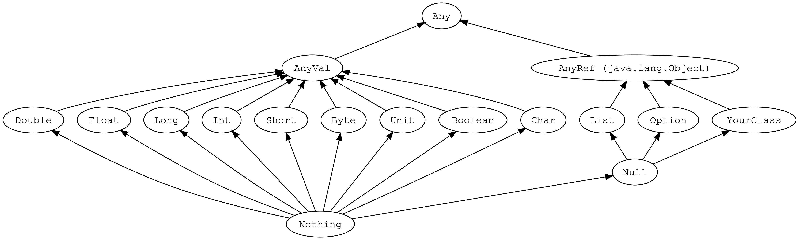
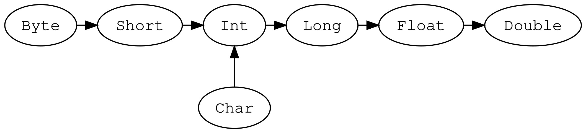

#### Scala入门

Scala语言是一门多范式（多范式是指：面向对象、面向过程、范型和函数式四种程序设计方法）的编程语言，平滑的集成了面向对象和函数式语言的特性。Scala语言被Martin Odersky在2001年开始设计。

- 特点
    - 和Java一样，运行在JVM上
    - 可以直接使用Java的类库
    - Scala语言非常的简洁（简洁不是简单）高效
    - 同时支持面向对象和面向函数式编程
- 阅读资料
    - [尚硅谷Scala视频（主要）](https://www.bilibili.com/video/BV1Xh411S7bP)
    - [Scala官网基础语法速查手册](https://docs.scala-lang.org/zh-cn/cheatsheets/index.html)
    - [Scala官网文档](https://docs.scala-lang.org/zh-cn/tour/tour-of-scala.html)
    - [大佬的笔记](https://github.com/tch0/notes/blob/master/Scala.md)

##### 1. 环境配置

Scala依赖于Java环境，所以要先安装Java环境，具体的Scala依赖的版本可以在[这里](https://docs.scala-lang.org/overviews/jdk-compatibility/overview.html)查看。我这里用JDK8配置Scala-2.12.10。

mac环境下安装scala并配置环境变量：

```shell
$ vim ~/.bash_profile
### 文件内容（根据自己的环境变量修改）
SCALA_HOME=/Library/scala-2.12.10
PATH=$PATH:$SCALA_HOME/bin

export SCALA_HOME PATH
###
$ source ~/.bash_profile
```

Scala和Python一样也有交互式环境，直接在终端中输入scala即可进入：

```shell
$ scala
```

使用REPL打印"Hello,World!"：

```scala
scala> println("Hello,World!")
Hello,World!
```

和Java一样我们也来手写一个HelloWorld源代码：

```scala
object HelloWorld {
  def main(args: Array[String]): Unit = {
    println("Hello, World!")
  }
}
```

使用scalac和scala命令编译运行：

```shell
$ scalac HelloWorld
$ scala HelloWorld
```

上面也提到过和Java都是运行在JVM上的，Scala也是编译成字节码运行的，所以可以使用java命令运行scala程序：

```shell
$ java -cp $SCALA_HOME/lib/scala-library.jar; HelloWorld
```

##### 2. IDEA环境配置

打开IDEA插件安装，安装Scala插件，之后创建Maven项目，Maven项目默认使用Java编写，所以需要自己手动创建scala的source root文件夹，创建后需要将目录标记为Source Root。之后在项目上右键添加Scala框架支持，配置好Scala SDK就可以创建Scala源文件了。

```scala
package com.yankee.chapter01

/**
 * object：关键字，声明一个单例对象（伴生对象）
 */
object HelloWorld {
  /**
   * main方法：从外部可以直接调用执行的方法
   * def 方法名称(参数名称: 参数类型): 返回值类型 = { 方法体 }
   * @param args 参数
   */
  def main(args: Array[String]): Unit = {
    println("Hello World!")
  }
}
```

Scala是一个完全面向对象的语言，所以没有静态语法，为了能调用静态语法（模仿静态语法），采用伴生对象单例的方式调用方法。在IDEA中使用插件Decompiler反编译`HelloWorld.scala`之后可以看到有两个对应的类：`HelloWorld`和`HelloWorld$`，其中`HelloWorld$`其实也就是`HelloWorld`的伴生对象，我们可以从Student中具体看看Java和Scala的一些区别。

Scala-Student：

```scala
class Student(name: String, age: Int) {
  def printInfo(): Unit = {
    println(name + "  " + age + "  " + Student.school)
  }
}

/**
 * 引入伴生对象
 */
object Student {
  val school: String = "清华"

  def main(args: Array[String]): Unit = {
    val alice = new Student("alice", 20)
    alice.printInfo()
  }
}
```

Java-Student：

```java
public class Student {
    /**
     * 姓名
     */
    private String name;

    /**
     * 年龄
     */
    private Integer age;

    /**
     * 类的静态属性
     */
    private static String school = "清华";
    
    public Student(String name, Integer age) {
        this.name = name;
        this.age = age;
    }
    
    public void printInfo() {
        System.out.println(this.name + "  " + this.age + "  " + Student.school);
    }

    public static void main(String[] args) {
        Student student = new Student("alice", 20);
        student.printInfo();
    }
}
```

扩展：常用的Java对象中都会定义getXxx和setXxx方法，同样的在scala中，只要在定义class的参数中添加var关键字同时也会定义和Java效果一样的getXxx和setXxx方法，只不过使用方法不同。如果在class的参数中添加val关键字只会定义getXxx，不能对对象的参数进行修改。这两者的异同可以反编译class文件仔细对照。

##### 3. 变量和数据类型

###### 1. 注释

Scala注释使用和Java完全一样，也分为单行注释、多行注释和文本注释。

```
（1）单行注释：//
（2）多行注释：/* */
（3）文档注释：/**
							*
							*/
```

###### 2. 变量和常量

```
var 变量名[: 变量类型] = 初始值
val 常量名[: 常量类型] = 初始值
```

因为Scala函数式编程的特点，能用常量就不使用变量。

- 声明变量时，类型可以省略，编译器自动推导，即类型推导
- 类型确定后，就不能修改，说明Scala是强数据类型语言
- 变量声明时，必须要有初始值
- 在声明/定义一个变量时，可以使用var或者val来修饰，var修饰的变量可改变，val修饰的变量不可改
- var修饰的对象引用可以改变，val修饰的对象则不能改变，但对象的状态（属性）却是可以改变的

###### 3. 标识符的命名规范

命名规则：

- 以字母或者下划线开头，后接字母、数字、下划线
- 以操作符开头，且只包含操作符（+-*/#!%等）
- 用反引号\`\`包括的任意字符串，即使是Scala的39个关键字也可以

关键字：

```
package,import,class,object,trait,extends,with,type,for
private,protected,abstract,sealed,final,implicit,lazy,override
try,catch,finally,throw
if,else,match,case,do,while,for,return,yield
def,val,var
this,super
new
true,false,null
```

其中有10个是Scala独有的Java没有：

```
object,trait,with,sealed,implicit,match,yield,def,val,var
```

###### 4. 字符串输出

字符串类型是String，有以下三种输出方式：

- 可以通过+号
- \*号连接，\*号表示一个字符串复制多次
- 字符串模板（插值字符串），可以通过$获取变量值

```scala
object Test04_StringType {
  def main(args: Array[String]): Unit = {
    //（1）字符串，通过+号连接
    val name = "alice"
    val age = 23
    println(age + "岁的" + name + "在家里学习")
    //（2）*用于将一个字符串复制多次并拼接
    println(name * 3)

    // printf用法：字符串，通过%传值
    printf("%d岁的%s在家里学习\n", age, name)

    //（3）字符串模板（插值字符串）：通过$获取变量值
    println(s"${age}岁的${name}在家里学习")

    val num = 2.3456
    println(s"The num is ${num}")
    // 格式化模板字符串：数据总长度为2位，如果数据长度本身不够，则需要用空格补位，后面的2表示小数点后2位
    println(f"The num is ${num}%2.2f")
    println(f"The num is ${num}%10.3f")
    println(raw"The num is ${num}%0.2f")

    // 三引号表示字符串，保持多行字符串的原格式输出
    val sql =
      s"""
         |select *
         |from
         |  student
         |where
         |  name = ${name}
         |and
         |  age > ${age}
         |""".stripMargin
    println(sql)
  }
}
```

###### 5. 键盘输入

基本语法：

```scala
import scala.io.StdIn

StdIn.readLine()
StdIn.readShort()
```

```scala
println("请输入您的大名：")
val name = StdIn.readLine()
println("请输入您的芳龄：")
val age = StdIn.readInt()
```

###### 6. 读写文件

```scala
object Test06_FileIO {
  def main(args: Array[String]): Unit = {
    // 1.从文件中读取数据
    val source: BufferedSource = Source.fromFile("01.scala-learning-atguigu/src/main/resources/test.txt")
    source.foreach(print)
    source.close()

    // 2.将数据写入文件
    val writer = new PrintWriter(new File("01.scala-learning-atguigu/src/main/resources/output.txt"))
    writer.write("hello,world from java writer")
    writer.close()
  }
}
```

###### 7. 数据类型

这里借用官网的一张图来描述Scala中的数据类型：



从图中可以清晰的看出Scala中的所有类型都是Any的子类，Any分为两大类：AnyVal（值类型）和AnyRef（引用类型）。其中Null是AnyRef的子类，Nothing是所有类型的子类。相比于Java有三个特殊的类型分别是：Unit、Null和Nothing。

- Unit：表示无值，只有一个实例，用于函数返回值
- Null：只有一个实例null，表示应用类型的空引用
- Nothing：确定没有正常的返回值，可以用Nothing泪执行返回值类型，一般用来接收异常的处理，无正确返回

###### 8. 数据类型转换

还是一样，借用官网的一张图来描述数据类型的转换：



这张图表示了Scala中的自动类型转换，也就是低精度数据类型向高精度数据类型转换，同样，如果是箭头的反方向，就存在精度丢失，也就是说要进行强制的数据类型转换。在Scala中进行强制数据类型转换是需要用到类似于toByte、toInt之类的方法。但是需要注意的是，这里的强制数据类型转换，如果存在精度丢失，只是简单的字节截断，不存在四舍五入等其他算法。

```scala
object Test09_Problem_DataTypeConversion {
  def main(args: Array[String]): Unit = {
    /*
    130对应的补码
    00000000 00000000 00000000 10000010

    转换成Byte截取最后一个字节：
    补码：10000010   原码：11111110
    -126
     */
    val n: Int = 130
    val b: Byte = n.toByte
    println(b)
  }
}
```

##### 4. 运算符

- 算数运算：`+ - * / %`,`+`可以用作一元运算的正号，也可以用于二元运算的加号，还可以用于字符串之间的连接。没有自增和自减语法
- 关系运算：`== != < > <= >=`，`==`在Java中表示引用类型的地址，在Scala中用来表示值是否相等。Scala中使用eq来判断是否引用相等
- 逻辑运算：`&& || !`，`&& ||`所有语言都支持短路，包括Scala
- 赋值运算：`= += -+ *= /= %=`
- 按位运算：`& | ^ ~`
- 移位运算：`<< >> >>>`，`<< >>`表示有符号的左移和右移，`>>>`表示无符号右移，有符号左移或右移不影响最高位的符号位。无符号左移后右边补0；无符号右移后高位根据符号为补齐，负数补1，正数补0
- Scala中所有运算符的本质都是对象的方法调用

##### 5. 流程控制

###### 1. IF-ELSE

```scala
if (条件表达式) {
	执行代码块
} else if (条件表达式) {
	执行代码块
} else {
	执行代码块
}
```

- Scala中的`if-else`也是有返回值的，具体返回值取决于满足条件的代码体的最后一行内容
- 如果Scala中的if或者else的逻辑代码只有一行，可以省略大括号，省略后只对最近的一行逻辑代码起作用
- 在一个分支中嵌套另一个完整的分支结构，被称为嵌套分支，嵌套分支不要超过3层

###### 2. FOR

Scala中为for循环提供了非常多的特性，这些for循环的特性被称之为for推导式或for表达式。

- 范围遍历：`for(i <- 1 to 10){}`，其中`1 to 10`其实是Int的一个方法调用，返回一个Range

- 范围遍历中`1 to 10`和`1 until 10`分别是包含右边界和不包含右边界，也可以直接使用Range类

- for循环中可以加入循环步长：`1 to 10 by 2`，和python有点类似，注意步长不能为0

- 范围遍历也是一个Range集合，所以for推导式也可以遍历普通集合：`for(i <- Collection){}`

- 迭代器哨卫：也叫循环保护式，循环守卫为true则进入循环内部，为false则跳过，类似于continue

  ```scala
  // 标准写法
  for (循环变量 <- 循环表达式 if 条件表达式) {
    执行代码块
  }
  
  // 等价于
  for (循环变量 <- 循环表达式) {
    if (条件表达式) {
      执行代码块
    }
  }
  ```

- 嵌套迭代器：可以将多个循环条件合并到一个for中

  ```scala
  // 标准写法
  for (循环变量 <- 循环表达式) {
    for (循环变量 <- 循环表达式) {
      执行代码块
    }
  }
  
  // 等价写法
  for (循环变量 <- 循环表达式; 循环变量 <- 循环表达式) {
    执行代码块
  }
  
  // 示例
  for (i <- 1 to 9; j <- 1 to i) {
    print(s"$j * $i = ${i * j} \t")
    if (j == i) println()
  }
  ```

- 值绑定：在for循环中定义临时值或者变量，与循环变量本身无关

  ```scala
  for (循环变量 <- 循环表达式; 其他变量处理逻辑) {
    执行代码块
  }
  
  // 示例
  for (i <- 1 to 10; pow = i << i) {
    println("i = " + i + ", pow = " + pow)
  }
  ```

- 循环里面有多个表达式，可以使用`{}`

  ```scala
  for {循环变量 <- 循环表达式
       循环变量 <- 循环表达式} {
    执行代码块
  }
  
  // 示例
  for {i <- 1 to 9
       j <- 1 to i} {
    print(s"$j * $i = ${i * j} \t")
    if (j == i) println()
  }
  ```

- 循环和`if-else`一样也有返回值，不过不同的是for表达式的返回值是Unit实例()

- 和python类似的是，Scala中的for推导式也可以使用yield，yield的操作每执行完一次循环，将数据接住并执行其他操作，执行完之后继续循环，最后的返回结果是一个Vector类型

  ```scala
  val seq: immutable.IndexedSeq[Int] = for (i <- 1 to 10; pow = i << i) yield pow
  println(seq)
  ```

###### 3. WHILE和DO-WHILE

- Scala中引入while和do...while是为了兼容Java
- 和for推导式不同，while语句没有返回值，即整个while语句的结果是Unit类型()
- 因为没有返回值，所以要用改语句来计算并返回结果时，就不可避免的使用变量，而变量需要声明在while循环的外部，就等于循环的内部对外部的变量造成了影响，不推荐使用，而是推荐使用for循环。

```scala
while (条件表达式) {
  执行代码块
}

do {
  执行代码块
} while (条件表达式)
```

###### 4. 循环中断

- Scala内置控制结构特地去掉了break和continue，是为了更好的适应函数式编程，推荐使用函数式的风格解决break和continue的功能，而不是一个关键字

- Scala中使用breakable控制结构来实现break和continue功能

- for循环中的循环守卫（迭代器哨卫）可以实现continue的功能

- 使用抛出异常捕获的方式退出循环

  ```scala
  try {
    for (i <- 0 until 5) {
      if (i == 3) {
        throw new RuntimeException
      }
      println(i)
    }
  } catch {
    // 什么都不做，只是退出循环
    case e: Exception =>
  }
  ```

- 使用Scala中的Breaks类中的break方法，实现异常抛出和捕获

  ```scala
  Breaks.breakable(
    for (i <- 0 until 5) {
      if (i == 3) Breaks.break()
      println(i)
    }
  )
  ```

#### 6. 函数式编程

- 面向对象编程：分解对象、行为、属性，然后通过对象的关系以及行为的调用来解决问题。耦合低，复用性高，可维护性强
- 面向过程编程：按照步骤来解决问题。执行效率更高
- 函数式编程：面向对象编程和面向过程编程都属于命令式编程，但是函数式编程并不关心具体运行过程，而是关心数据之间的映射关系。纯粹的函数式编程没有变量，只有常量，计算的过程就是不停的求表达式的值。不关心底层实现，对人来说更好理解，相对的编译器处理就比较复杂。编程效率高，函数式编程的不可变性，对于函数特定输入输出是特定的，与环境上下文无关。函数式编程无副作用，利于并行处理，所以Scala非常利于应用于大数据处理。

###### 1. 函数定义

```scala
def 函数名(参数名[: 参数类型], 参数名[: 参数类型]): 函数返回值类型 = {
  函数题
}
```

- 函数式编程语言中，函数是一等公民（可以像对象一样赋值、作为参数返回值），可以在任何代码块中定义函数
- 一般将定义在类或者对象中（最外层）的函数称为方法，而定义在方法中（内层）的称为函数。广义上都是函数
- 返回值使用return进行返回，如果没有return，就默认使用最后一行代码作为返回值

###### 2. 函数参数

- 可变参数

    - `def function(str: String*): Unit = {}`
    - 如果参数列表中有多个参数，那么可变参数要放置在最后

- 参数默认值

    - `def function(name: String = "alice"): Unit = {}`
    - 一般将有默认值的参数放在参数列表的后面

- 带名参数

    - 调用时带参数名称

      ```scala
      def function(name: String = "bob", age: Int): Unit = {
        println(s"${age}岁的${name}在学习Scala")
      }
      function("alice", 23)
      function(age = 22)
      ```

    - 默认不使用参数名称的就是按照参数列表的顺序

    - 调用时带名参数必须在实参列表的末尾

    - 和默认参数一起使用很方便，有多个默认参数时，可以只根据参数名称覆盖其中一个

- 函数至简原则

    - return可以省略，Scala会使用函数体的最后一行代码作为返回值

    - 如果函数体只有一行代码，可以省略花括号

    - 返回值类型如果能够推断出来，那么可以省略（:和返回值类型一起省略）

    - 如果有return，则不能省略返回值类型，必须指定

    - 如果函数明确声明Unit，那么即使函数体中使用return关键字也不起作用

    - Scala如果期望时无返回值类型，可以省略等号

    - 如果函数无参，但是声明了参数列表，那么调用时，小括号可加可不加

    - 如果函数没有参数列表，那么小括号可以省略，调用时小括号必须省略

    - 如果不关心名称，只关心逻辑处理，那么函数名（def）可以省略，也就是匿名函数

      ```scala
      val result = (name: String, age: Int) => s"${age}岁的${name}在学习Scala"
      ```

###### 3. 匿名函数

- 匿名函数可以被赋值给一个变量，也叫lambda表达式

  ```scala
  def fun = (name: String) => println(s"${age}岁的${name}在学习Scala")
  ```

- 定义一个函数，以函数作为参数输入时可以直接使用lambda表达式

  ```scala
  // String => Unit 表示函数的类型
  def f0(func: String => Unit): Unit = {
    func("bob")
  }
  
  // 调用
  f0(fun)
  f0((name: String) => {println(s"${name}在这里")})
  ```

- 匿名函数定义时不能有函数的返回值类型

- 匿名函数的简化原则

    - 在调用以函数为参数的函数时，实参的类型可以忽略，会根据形参进行自动的推导
    - 类型省略之后，发现只有一个参数，则圆括号可以省略；其他没有参数和参数超过1的永远不能省略圆括号，`f0(name => { println(name) }) `
    - 如果匿名函数的函数体只有一行，花括号也可以省略，`f0(name => println(name))`
    - 如果参数只出现一次，则参数省略且后面可以用`_`代替，实参和`=>`都可以省略，`f0(println(_))`
    - 如果可以推导出当前传入的println是一个函数体，而不是调用语句，可以直接省略`_`，`f0(println)`

  ```scala
  // 示例，定义一个二元运算函数，只操作1和2两个数，具体做什么运算通过参数传入
  def dualFunctionOneAndTwo(fun: (Int, Int) => Int): Int = {
    fun(1, 2)
  }
  
  val add = (a: Int, b: Int) => a + b
  val minus = (a: Int, b: Int) => a - b
  println(dualFunctionOneAndTwo(add))
  println(dualFunctionOneAndTwo(minus))
  println(dualFunctionOneAndTwo((a, b) => a / b))
  println(dualFunctionOneAndTwo(_ + _))
  println(dualFunctionOneAndTwo(-_ + _))
  ```

###### 4. 高阶函数

- 函数可以作为值进行传递、函数可以作为参数进行传递、函数可以作为函数返回值返回

  ```scala
  def f(n: Int): Int = {
    println("f函数被调用")
    n + 1
  }
  ```

- 函数作为值进行传递：经过赋值之后会变成一个函数的引用地址

  ```scala
  val f1 = f _
  val f2: Int => Int = f
  println(f1)
  println(f1(100))
  println(f2)
  println(f2(100))
  ```

- 函数作为参数进行传递：可以传匿名函数、函数名称和lambda表达式

  ```scala
  def dualEval(op: (Int, Int) => Int, a: Int, b: Int): Int = {
    op(a, b)
  }
  
  def add(a: Int, b: Int): Int = a + b
  def minus(a: Int, b: Int) = a - b
  println(dualEval(add, 1, 2))
  println(dualEval(minus, 1, 2))
  println(dualEval(_ + _, 1, 2))
  ```

- 函数作为函数返回值返回：函数嵌套

  ```scala
  def f5(): (Int => Unit) = {
    def f6(a: Int): Unit = {
      println("f6调用 " + a)
    }
    // 函数直接返回，如果没有声明外层函数的返回值类型，那么返回时要写：f6 _
    // f6 _
    f6
  }
  
  // 此时返回函数的引用地址
  println(f5())
  // 此时返回内部函数的调用结果
  println(f5()(23))
  ```

######  5. 高阶函数案例

