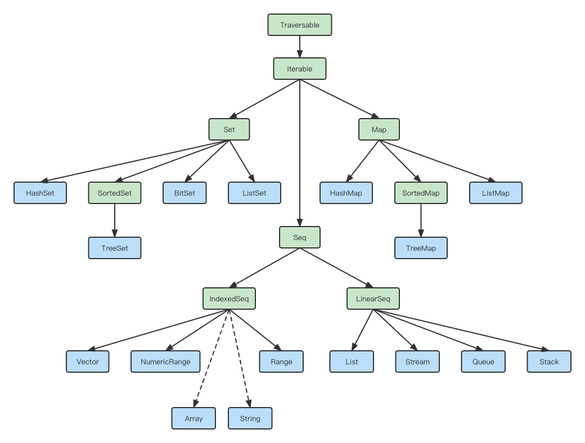
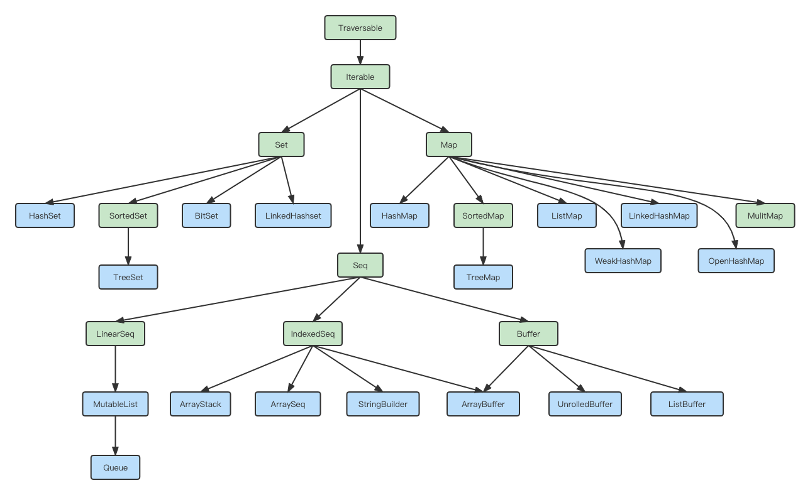

<!-- START doctoc generated TOC please keep comment here to allow auto update -->
<!-- DON'T EDIT THIS SECTION, INSTEAD RE-RUN doctoc TO UPDATE -->
**Table of Contents**  *generated with [DocToc](https://github.com/thlorenz/doctoc)*

- [Scala入门](#scala%E5%85%A5%E9%97%A8)
  - [1. 环境配置](#1-%E7%8E%AF%E5%A2%83%E9%85%8D%E7%BD%AE)
  - [2. IDEA环境配置](#2-idea%E7%8E%AF%E5%A2%83%E9%85%8D%E7%BD%AE)
  - [3. 变量和数据类型](#3-%E5%8F%98%E9%87%8F%E5%92%8C%E6%95%B0%E6%8D%AE%E7%B1%BB%E5%9E%8B)
    - [1. 注释](#1-%E6%B3%A8%E9%87%8A)
    - [2. 变量和常量](#2-%E5%8F%98%E9%87%8F%E5%92%8C%E5%B8%B8%E9%87%8F)
    - [3. 标识符的命名规范](#3-%E6%A0%87%E8%AF%86%E7%AC%A6%E7%9A%84%E5%91%BD%E5%90%8D%E8%A7%84%E8%8C%83)
    - [4. 字符串输出](#4-%E5%AD%97%E7%AC%A6%E4%B8%B2%E8%BE%93%E5%87%BA)
    - [5. 键盘输入](#5-%E9%94%AE%E7%9B%98%E8%BE%93%E5%85%A5)
    - [6. 读写文件](#6-%E8%AF%BB%E5%86%99%E6%96%87%E4%BB%B6)
    - [7. 数据类型](#7-%E6%95%B0%E6%8D%AE%E7%B1%BB%E5%9E%8B)
    - [8. 数据类型转换](#8-%E6%95%B0%E6%8D%AE%E7%B1%BB%E5%9E%8B%E8%BD%AC%E6%8D%A2)
  - [4. 运算符](#4-%E8%BF%90%E7%AE%97%E7%AC%A6)
  - [5. 流程控制](#5-%E6%B5%81%E7%A8%8B%E6%8E%A7%E5%88%B6)
    - [1. IF-ELSE](#1-if-else)
    - [2. FOR](#2-for)
    - [3. WHILE和DO-WHILE](#3-while%E5%92%8Cdo-while)
    - [4. 循环中断](#4-%E5%BE%AA%E7%8E%AF%E4%B8%AD%E6%96%AD)
  - [6. 函数式编程](#6-%E5%87%BD%E6%95%B0%E5%BC%8F%E7%BC%96%E7%A8%8B)
    - [1. 函数定义](#1-%E5%87%BD%E6%95%B0%E5%AE%9A%E4%B9%89)
    - [2. 函数参数](#2-%E5%87%BD%E6%95%B0%E5%8F%82%E6%95%B0)
    - [3. 匿名函数](#3-%E5%8C%BF%E5%90%8D%E5%87%BD%E6%95%B0)
    - [4. 高阶函数](#4-%E9%AB%98%E9%98%B6%E5%87%BD%E6%95%B0)
    - [5. 高阶函数案例](#5-%E9%AB%98%E9%98%B6%E5%87%BD%E6%95%B0%E6%A1%88%E4%BE%8B)
    - [6. 函数的柯里化和闭包](#6-%E5%87%BD%E6%95%B0%E7%9A%84%E6%9F%AF%E9%87%8C%E5%8C%96%E5%92%8C%E9%97%AD%E5%8C%85)
    - [7. 递归函数](#7-%E9%80%92%E5%BD%92%E5%87%BD%E6%95%B0)
    - [8. 控制抽象](#8-%E6%8E%A7%E5%88%B6%E6%8A%BD%E8%B1%A1)
    - [9. 惰性加载](#9-%E6%83%B0%E6%80%A7%E5%8A%A0%E8%BD%BD)
  - [7. 包管理](#7-%E5%8C%85%E7%AE%A1%E7%90%86)
  - [8. 面向对象](#8-%E9%9D%A2%E5%90%91%E5%AF%B9%E8%B1%A1)
    - [1. 类和对象](#1-%E7%B1%BB%E5%92%8C%E5%AF%B9%E8%B1%A1)
    - [2. 封装](#2-%E5%B0%81%E8%A3%85)
    - [3. 继承](#3-%E7%BB%A7%E6%89%BF)
    - [4. 多态](#4-%E5%A4%9A%E6%80%81)
    - [5. 抽象类](#5-%E6%8A%BD%E8%B1%A1%E7%B1%BB)
    - [6. 匿名子类](#6-%E5%8C%BF%E5%90%8D%E5%AD%90%E7%B1%BB)
    - [7. 单例对象（伴生对象）](#7-%E5%8D%95%E4%BE%8B%E5%AF%B9%E8%B1%A1%E4%BC%B4%E7%94%9F%E5%AF%B9%E8%B1%A1)
    - [8. 特质](#8-%E7%89%B9%E8%B4%A8)
    - [9. 扩展](#9-%E6%89%A9%E5%B1%95)
  - [9. 集合](#9-%E9%9B%86%E5%90%88)
    - [1. 集合简介](#1-%E9%9B%86%E5%90%88%E7%AE%80%E4%BB%8B)
    - [2. 数组（Array）](#2-%E6%95%B0%E7%BB%84array)
    - [3. 列表（List）](#3-%E5%88%97%E8%A1%A8list)
    - [4. 集合（Set）](#4-%E9%9B%86%E5%90%88set)
    - [5. 映射（Map）](#5-%E6%98%A0%E5%B0%84map)
    - [6. 元组（Tuple）](#6-%E5%85%83%E7%BB%84tuple)
    - [7. 集合常用函数](#7-%E9%9B%86%E5%90%88%E5%B8%B8%E7%94%A8%E5%87%BD%E6%95%B0)
    - [8. 队列（Queue）](#8-%E9%98%9F%E5%88%97queue)
    - [9. 并行集合](#9-%E5%B9%B6%E8%A1%8C%E9%9B%86%E5%90%88)
  - [10. 模式匹配](#10-%E6%A8%A1%E5%BC%8F%E5%8C%B9%E9%85%8D)
    - [1. 基本语法](#1-%E5%9F%BA%E6%9C%AC%E8%AF%AD%E6%B3%95)
    - [2. 模式守卫（模式哨卫）](#2-%E6%A8%A1%E5%BC%8F%E5%AE%88%E5%8D%AB%E6%A8%A1%E5%BC%8F%E5%93%A8%E5%8D%AB)
    - [3. 模式匹配类型](#3-%E6%A8%A1%E5%BC%8F%E5%8C%B9%E9%85%8D%E7%B1%BB%E5%9E%8B)
    - [4. 变量声明中的模式匹配](#4-%E5%8F%98%E9%87%8F%E5%A3%B0%E6%98%8E%E4%B8%AD%E7%9A%84%E6%A8%A1%E5%BC%8F%E5%8C%B9%E9%85%8D)
    - [5. `for`推导式中的模式匹配](#5-for%E6%8E%A8%E5%AF%BC%E5%BC%8F%E4%B8%AD%E7%9A%84%E6%A8%A1%E5%BC%8F%E5%8C%B9%E9%85%8D)
    - [6. 匹配对象](#6-%E5%8C%B9%E9%85%8D%E5%AF%B9%E8%B1%A1)
    - [7. 匹配样例类](#7-%E5%8C%B9%E9%85%8D%E6%A0%B7%E4%BE%8B%E7%B1%BB)
    - [8. 偏函数](#8-%E5%81%8F%E5%87%BD%E6%95%B0)
  - [11. 异常处理](#11-%E5%BC%82%E5%B8%B8%E5%A4%84%E7%90%86)
  - [12. 隐式转换](#12-%E9%9A%90%E5%BC%8F%E8%BD%AC%E6%8D%A2)
    - [1. 隐式函数](#1-%E9%9A%90%E5%BC%8F%E5%87%BD%E6%95%B0)
    - [2. 隐式参数](#2-%E9%9A%90%E5%BC%8F%E5%8F%82%E6%95%B0)
    - [3. 隐式类](#3-%E9%9A%90%E5%BC%8F%E7%B1%BB)
    - [4. 隐式解析机制](#4-%E9%9A%90%E5%BC%8F%E8%A7%A3%E6%9E%90%E6%9C%BA%E5%88%B6)
  - [13. 泛型](#13-%E6%B3%9B%E5%9E%8B)
    - [1. 泛型](#1-%E6%B3%9B%E5%9E%8B)
    - [2. 协变和逆变](#2-%E5%8D%8F%E5%8F%98%E5%92%8C%E9%80%86%E5%8F%98)
    - [3. 泛型上下限](#3-%E6%B3%9B%E5%9E%8B%E4%B8%8A%E4%B8%8B%E9%99%90)
    - [4. 上下文限定](#4-%E4%B8%8A%E4%B8%8B%E6%96%87%E9%99%90%E5%AE%9A)

<!-- END doctoc generated TOC please keep comment here to allow auto update -->

#### Scala入门

Scala语言是一门多范式（多范式是指：面向对象、面向过程、范型和函数式四种程序设计方法）的编程语言，平滑的集成了面向对象和函数式语言的特性。Scala语言被Martin Odersky在2001年开始设计。

- 特点
  - 和Java一样，运行在JVM上
  - 可以直接使用Java的类库
  - Scala语言非常的简洁（简洁不是简单）高效
  - 同时支持面向对象和面向函数式编程
- 阅读资料
  - [尚硅谷Scala视频（主要）](https://www.bilibili.com/video/BV1Xh411S7bP)
  - [Scala官网基础语法速查手册](https://docs.scala-lang.org/zh-cn/cheatsheets/index.html)
  - [Scala官网文档](https://docs.scala-lang.org/zh-cn/tour/tour-of-scala.html)
  - [大佬的笔记](https://github.com/tch0/notes/blob/master/Scala.md)

##### 1. 环境配置

Scala依赖于Java环境，所以要先安装Java环境，具体的Scala依赖的版本可以在[这里](https://docs.scala-lang.org/overviews/jdk-compatibility/overview.html)查看。我这里用JDK8配置Scala-2.12.10。

mac环境下安装scala并配置环境变量：

```shell
$ vim ~/.bash_profile
### 文件内容（根据自己的环境变量修改）
SCALA_HOME=/Library/scala-2.12.10
PATH=$PATH:$SCALA_HOME/bin

export SCALA_HOME PATH
###
$ source ~/.bash_profile
```

Scala和Python一样也有交互式环境，直接在终端中输入scala即可进入：

```shell
$ scala
```

使用REPL打印"Hello,World!"：

```scala
scala> println("Hello,World!")
Hello,World!
```

和Java一样我们也来手写一个HelloWorld源代码：

```scala
object HelloWorld {
  def main(args: Array[String]): Unit = {
    println("Hello, World!")
  }
}
```

使用scalac和scala命令编译运行：

```shell
$ scalac HelloWorld
$ scala HelloWorld
```

上面也提到过和Java都是运行在JVM上的，Scala也是编译成字节码运行的，所以可以使用java命令运行scala程序：

```shell
$ java -cp $SCALA_HOME/lib/scala-library.jar; HelloWorld
```

##### 2. IDEA环境配置

打开IDEA插件安装，安装Scala插件，之后创建Maven项目，Maven项目默认使用Java编写，所以需要自己手动创建scala的source root文件夹，创建后需要将目录标记为Source Root。之后在项目上右键添加Scala框架支持，配置好Scala SDK就可以创建Scala源文件了。

```scala
package com.yankee.chapter01

/**
 * object：关键字，声明一个单例对象（伴生对象）
 */
object HelloWorld {
  /**
   * main方法：从外部可以直接调用执行的方法
   * def 方法名称(参数名称: 参数类型): 返回值类型 = { 方法体 }
   * @param args 参数
   */
  def main(args: Array[String]): Unit = {
    println("Hello World!")
  }
}
```

Scala是一个完全面向对象的语言，所以没有静态语法，为了能调用静态语法（模仿静态语法），采用伴生对象单例的方式调用方法。在IDEA中使用插件Decompiler反编译`HelloWorld.scala`之后可以看到有两个对应的类：`HelloWorld`和`HelloWorld$`，其中`HelloWorld$`其实也就是`HelloWorld`的伴生对象，我们可以从Student中具体看看Java和Scala的一些区别。

Scala-Student：

```scala
class Student(name: String, age: Int) {
  def printInfo(): Unit = {
    println(name + "  " + age + "  " + Student.school)
  }
}

/**
 * 引入伴生对象
 */
object Student {
  val school: String = "清华"

  def main(args: Array[String]): Unit = {
    val alice = new Student("alice", 20)
    alice.printInfo()
  }
}
```

Java-Student：

```java
public class Student {
    /**
     * 姓名
     */
    private String name;

    /**
     * 年龄
     */
    private Integer age;

    /**
     * 类的静态属性
     */
    private static String school = "清华";
    
    public Student(String name, Integer age) {
        this.name = name;
        this.age = age;
    }
    
    public void printInfo() {
        System.out.println(this.name + "  " + this.age + "  " + Student.school);
    }

    public static void main(String[] args) {
        Student student = new Student("alice", 20);
        student.printInfo();
    }
}
```

扩展：常用的Java对象中都会定义getXxx和setXxx方法，同样的在scala中，只要在定义class的参数中添加var关键字同时也会定义和Java效果一样的getXxx和setXxx方法，只不过使用方法不同。如果在class的参数中添加val关键字只会定义getXxx，不能对对象的参数进行修改。这两者的异同可以反编译class文件仔细对照。

##### 3. 变量和数据类型

###### 1. 注释

Scala注释使用和Java完全一样，也分为单行注释、多行注释和文本注释。

```
（1）单行注释：//
（2）多行注释：/* */
（3）文档注释：/**
              *
              */
```

###### 2. 变量和常量

```
var 变量名[: 变量类型] = 初始值
val 常量名[: 常量类型] = 初始值
```

因为Scala函数式编程的特点，能用常量就不使用变量。

- 声明变量时，类型可以省略，编译器自动推导，即类型推导
- 类型确定后，就不能修改，说明Scala是强数据类型语言
- 变量声明时，必须要有初始值
- 在声明/定义一个变量时，可以使用var或者val来修饰，var修饰的变量可改变，val修饰的变量不可改
- var修饰的对象引用可以改变，val修饰的对象则不能改变，但对象的状态（属性）却是可以改变的

###### 3. 标识符的命名规范

命名规则：

- 以字母或者下划线开头，后接字母、数字、下划线
- 以操作符开头，且只包含操作符（+-*/#!%等）
- 用反引号\`\`包括的任意字符串，即使是Scala的39个关键字也可以

关键字：

```
package,import,class,object,trait,extends,with,type,for
private,protected,abstract,sealed,final,implicit,lazy,override
try,catch,finally,throw
if,else,match,case,do,while,for,return,yield
def,val,var
this,super
new
true,false,null
```

其中有10个是Scala独有的Java没有：

```
object,trait,with,sealed,implicit,match,yield,def,val,var
```

###### 4. 字符串输出

字符串类型是String，有以下三种输出方式：

- 可以通过+号
- \*号连接，\*号表示一个字符串复制多次
- 字符串模板（插值字符串），可以通过$获取变量值

```scala
object Test04_StringType {
  def main(args: Array[String]): Unit = {
    //（1）字符串，通过+号连接
    val name = "alice"
    val age = 23
    println(age + "岁的" + name + "在家里学习")
    //（2）*用于将一个字符串复制多次并拼接
    println(name * 3)

    // printf用法：字符串，通过%传值
    printf("%d岁的%s在家里学习\n", age, name)

    //（3）字符串模板（插值字符串）：通过$获取变量值
    println(s"${age}岁的${name}在家里学习")

    val num = 2.3456
    println(s"The num is ${num}")
    // 格式化模板字符串：数据总长度为2位，如果数据长度本身不够，则需要用空格补位，后面的2表示小数点后2位
    println(f"The num is ${num}%2.2f")
    println(f"The num is ${num}%10.3f")
    println(raw"The num is ${num}%0.2f")

    // 三引号表示字符串，保持多行字符串的原格式输出
    val sql =
      s"""
         |select *
         |from
         |  student
         |where
         |  name = ${name}
         |and
         |  age > ${age}
         |""".stripMargin
    println(sql)
  }
}
```

###### 5. 键盘输入

基本语法：

```scala
import scala.io.StdIn

StdIn.readLine()
StdIn.readShort()
```

```scala
println("请输入您的大名：")
val name = StdIn.readLine()
println("请输入您的芳龄：")
val age = StdIn.readInt()
```

###### 6. 读写文件

```scala
object Test06_FileIO {
  def main(args: Array[String]): Unit = {
    // 1.从文件中读取数据
    val source: BufferedSource = Source.fromFile("01.scala-learning-atguigu/src/main/resources/test.txt")
    source.foreach(print)
    source.close()

    // 2.将数据写入文件
    val writer = new PrintWriter(new File("01.scala-learning-atguigu/src/main/resources/output.txt"))
    writer.write("hello,world from java writer")
    writer.close()
  }
}
```

###### 7. 数据类型

这里借用官网的一张图来描述Scala中的数据类型：


从图中可以清晰的看出Scala中的所有类型都是Any的子类，Any分为两大类：AnyVal（值类型）和AnyRef（引用类型）。其中Null是AnyRef的子类，Nothing是所有类型的子类。相比于Java有三个特殊的类型分别是：Unit、Null和Nothing。

- Unit：表示无值，只有一个实例，用于函数返回值
- Null：只有一个实例null，表示应用类型的空引用
- Nothing：确定没有正常的返回值，可以用Nothing泪执行返回值类型，一般用来接收异常的处理，无正确返回

###### 8. 数据类型转换

还是一样，借用官网的一张图来描述数据类型的转换：


这张图表示了Scala中的自动类型转换，也就是低精度数据类型向高精度数据类型转换，同样，如果是箭头的反方向，就存在精度丢失，也就是说要进行强制的数据类型转换。在Scala中进行强制数据类型转换是需要用到类似于toByte、toInt之类的方法。但是需要注意的是，这里的强制数据类型转换，如果存在精度丢失，只是简单的字节截断，不存在四舍五入等其他算法。

```scala
object Test09_Problem_DataTypeConversion {
  def main(args: Array[String]): Unit = {
    /*
    130对应的补码
    00000000 00000000 00000000 10000010

    转换成Byte截取最后一个字节：
    补码：10000010   原码：11111110
    -126
     */
    val n: Int = 130
    val b: Byte = n.toByte
    println(b)
  }
}
```

##### 4. 运算符

- 算数运算：`+ - * / %`,`+`可以用作一元运算的正号，也可以用于二元运算的加号，还可以用于字符串之间的连接。没有自增和自减语法
- 关系运算：`== != < > <= >=`，`==`在Java中表示引用类型的地址，在Scala中用来表示值是否相等。Scala中使用eq来判断是否引用相等
- 逻辑运算：`&& || !`，`&& ||`所有语言都支持短路，包括Scala
- 赋值运算：`= += -+ *= /= %=`
- 按位运算：`& | ^ ~`
- 移位运算：`<< >> >>>`，`<< >>`表示有符号的左移和右移，`>>>`表示无符号右移，有符号左移或右移不影响最高位的符号位。无符号左移后右边补0；无符号右移后高位根据符号为补齐，负数补1，正数补0
- Scala中所有运算符的本质都是对象的方法调用

##### 5. 流程控制

###### 1. IF-ELSE

```scala
if (条件表达式) {
	执行代码块
} else if (条件表达式) {
	执行代码块
} else {
	执行代码块
}
```

- Scala中的`if-else`也是有返回值的，具体返回值取决于满足条件的代码体的最后一行内容
- 如果Scala中的if或者else的逻辑代码只有一行，可以省略大括号，省略后只对最近的一行逻辑代码起作用
- 在一个分支中嵌套另一个完整的分支结构，被称为嵌套分支，嵌套分支不要超过3层

###### 2. FOR

Scala中为for循环提供了非常多的特性，这些for循环的特性被称之为for推导式或for表达式。

- 范围遍历：`for(i <- 1 to 10){}`，其中`1 to 10`其实是Int的一个方法调用，返回一个Range

- 范围遍历中`1 to 10`和`1 until 10`分别是包含右边界和不包含右边界，也可以直接使用Range类

- for循环中可以加入循环步长：`1 to 10 by 2`，和python有点类似，注意步长不能为0

- 范围遍历也是一个Range集合，所以for推导式也可以遍历普通集合：`for(i <- Collection){}`

- 迭代器哨卫：也叫循环保护式，循环守卫为true则进入循环内部，为false则跳过，类似于continue

  ```scala
  // 标准写法
  for (循环变量 <- 循环表达式 if 条件表达式) {
    执行代码块
  }
  
  // 等价于
  for (循环变量 <- 循环表达式) {
    if (条件表达式) {
      执行代码块
    }
  }
  ```

- 嵌套迭代器：可以将多个循环条件合并到一个for中

  ```scala
  // 标准写法
  for (循环变量 <- 循环表达式) {
    for (循环变量 <- 循环表达式) {
      执行代码块
    }
  }
  
  // 等价写法
  for (循环变量 <- 循环表达式; 循环变量 <- 循环表达式) {
    执行代码块
  }
  
  // 示例
  for (i <- 1 to 9; j <- 1 to i) {
    print(s"$j * $i = ${i * j} \t")
    if (j == i) println()
  }
  ```

- 值绑定：在for循环中定义临时值或者变量，与循环变量本身无关

  ```scala
  for (循环变量 <- 循环表达式; 其他变量处理逻辑) {
    执行代码块
  }
  
  // 示例
  for (i <- 1 to 10; pow = i << i) {
    println("i = " + i + ", pow = " + pow)
  }
  ```

- 循环里面有多个表达式，可以使用`{}`

  ```scala
  for {循环变量 <- 循环表达式
       循环变量 <- 循环表达式} {
    执行代码块
  }
  
  // 示例
  for {i <- 1 to 9
       j <- 1 to i} {
    print(s"$j * $i = ${i * j} \t")
    if (j == i) println()
  }
  ```

- 循环和`if-else`一样也有返回值，不过不同的是for表达式的返回值是Unit实例()

- 和python类似的是，Scala中的for推导式也可以使用yield，yield的操作每执行完一次循环，将数据接住并执行其他操作，执行完之后继续循环，最后的返回结果是一个Vector类型

  ```scala
  val seq: immutable.IndexedSeq[Int] = for (i <- 1 to 10; pow = i << i) yield pow
  println(seq)
  ```

###### 3. WHILE和DO-WHILE

- Scala中引入while和do...while是为了兼容Java
- 和for推导式不同，while语句没有返回值，即整个while语句的结果是Unit类型()
- 因为没有返回值，所以要用改语句来计算并返回结果时，就不可避免的使用变量，而变量需要声明在while循环的外部，就等于循环的内部对外部的变量造成了影响，不推荐使用，而是推荐使用for循环。

```scala
while (条件表达式) {
  执行代码块
}

do {
  执行代码块
} while (条件表达式)
```

###### 4. 循环中断

- Scala内置控制结构特地去掉了break和continue，是为了更好的适应函数式编程，推荐使用函数式的风格解决break和continue的功能，而不是一个关键字

- Scala中使用breakable控制结构来实现break和continue功能

- for循环中的循环守卫（迭代器哨卫）可以实现continue的功能

- 使用抛出异常捕获的方式退出循环

  ```scala
  try {
    for (i <- 0 until 5) {
      if (i == 3) {
        throw new RuntimeException
      }
      println(i)
    }
  } catch {
    // 什么都不做，只是退出循环
    case e: Exception =>
  }
  ```

- 使用Scala中的Breaks类中的break方法，实现异常抛出和捕获

  ```scala
  Breaks.breakable(
    for (i <- 0 until 5) {
      if (i == 3) Breaks.break()
      println(i)
    }
  )
  ```

##### 6. 函数式编程

- 面向对象编程：分解对象、行为、属性，然后通过对象的关系以及行为的调用来解决问题。耦合低，复用性高，可维护性强
- 面向过程编程：按照步骤来解决问题。执行效率更高
- 函数式编程：面向对象编程和面向过程编程都属于命令式编程，但是函数式编程并不关心具体运行过程，而是关心数据之间的映射关系。纯粹的函数式编程没有变量，只有常量，计算的过程就是不停的求表达式的值。不关心底层实现，对人来说更好理解，相对的编译器处理就比较复杂。编程效率高，函数式编程的不可变性，对于函数特定输入输出是特定的，与环境上下文无关。函数式编程无副作用，利于并行处理，所以Scala非常利于应用于大数据处理。

###### 1. 函数定义

```scala
def 函数名(参数名[: 参数类型], 参数名[: 参数类型]): 函数返回值类型 = {
  函数题
}
```

- 函数式编程语言中，函数是一等公民（可以像对象一样赋值、作为参数返回值），可以在任何代码块中定义函数
- 一般将定义在类或者对象中（最外层）的函数称为方法，而定义在方法中（内层）的称为函数。广义上都是函数
- 返回值使用return进行返回，如果没有return，就默认使用最后一行代码作为返回值

###### 2. 函数参数

- 可变参数

  - `def function(str: String*): Unit = {}`
  - 如果参数列表中有多个参数，那么可变参数要放置在最后

- 参数默认值

  - `def function(name: String = "alice"): Unit = {}`
  - 一般将有默认值的参数放在参数列表的后面

- 带名参数

  - 调用时带参数名称

    ```scala
    def function(name: String = "bob", age: Int): Unit = {
      println(s"${age}岁的${name}在学习Scala")
    }
    function("alice", 23)
    function(age = 22)
    ```

  - 默认不使用参数名称的就是按照参数列表的顺序

  - 调用时带名参数必须在实参列表的末尾

  - 和默认参数一起使用很方便，有多个默认参数时，可以只根据参数名称覆盖其中一个

- 函数至简原则

  - return可以省略，Scala会使用函数体的最后一行代码作为返回值

  - 如果函数体只有一行代码，可以省略花括号

  - 返回值类型如果能够推断出来，那么可以省略（:和返回值类型一起省略）

  - 如果有return，则不能省略返回值类型，必须指定

  - 如果函数明确声明Unit，那么即使函数体中使用return关键字也不起作用

  - Scala如果期望时无返回值类型，可以省略等号

  - 如果函数无参，但是声明了参数列表，那么调用时，小括号可加可不加

  - 如果函数没有参数列表，那么小括号可以省略，调用时小括号必须省略

  - 如果不关心名称，只关心逻辑处理，那么函数名（def）可以省略，也就是匿名函数

    ```scala
    val result = (name: String, age: Int) => s"${age}岁的${name}在学习Scala"
    ```

###### 3. 匿名函数

- 匿名函数可以被赋值给一个变量，也叫lambda表达式

  ```scala
  def fun = (name: String) => println(s"${age}岁的${name}在学习Scala")
  ```

- 定义一个函数，以函数作为参数输入时可以直接使用lambda表达式

  ```scala
  // String => Unit 表示函数的类型
  def f0(func: String => Unit): Unit = {
    func("bob")
  }
  
  // 调用
  f0(fun)
  f0((name: String) => {println(s"${name}在这里")})
  ```

- 匿名函数定义时不能有函数的返回值类型

- 匿名函数的简化原则

  - 在调用以函数为参数的函数时，实参的类型可以忽略，会根据形参进行自动的推导
  - 类型省略之后，发现只有一个参数，则圆括号可以省略；其他没有参数和参数超过1的永远不能省略圆括号，`f0(name => { println(name) }) `
  - 如果匿名函数的函数体只有一行，花括号也可以省略，`f0(name => println(name))`
  - 如果参数只出现一次，则参数省略且后面可以用`_`代替，实参和`=>`都可以省略，`f0(println(_))`
  - 如果可以推导出当前传入的println是一个函数体，而不是调用语句，可以直接省略`_`，`f0(println)`

  ```scala
  // 示例，定义一个二元运算函数，只操作1和2两个数，具体做什么运算通过参数传入
  def dualFunctionOneAndTwo(fun: (Int, Int) => Int): Int = {
    fun(1, 2)
  }
  
  val add = (a: Int, b: Int) => a + b
  val minus = (a: Int, b: Int) => a - b
  println(dualFunctionOneAndTwo(add))
  println(dualFunctionOneAndTwo(minus))
  println(dualFunctionOneAndTwo((a, b) => a / b))
  println(dualFunctionOneAndTwo(_ + _))
  println(dualFunctionOneAndTwo(-_ + _))
  ```

###### 4. 高阶函数

- 函数可以作为值进行传递、函数可以作为参数进行传递、函数可以作为函数返回值返回

  ```scala
  def f(n: Int): Int = {
    println("f函数被调用")
    n + 1
  }
  ```

- 函数作为值进行传递：经过赋值之后会变成一个函数的引用地址

  ```scala
  val f1 = f _
  val f2: Int => Int = f
  println(f1)
  println(f1(100))
  println(f2)
  println(f2(100))
  ```

- 函数作为参数进行传递：可以传匿名函数、函数名称和lambda表达式

  ```scala
  def dualEval(op: (Int, Int) => Int, a: Int, b: Int): Int = {
    op(a, b)
  }
  
  def add(a: Int, b: Int): Int = a + b
  def minus(a: Int, b: Int) = a - b
  println(dualEval(add, 1, 2))
  println(dualEval(minus, 1, 2))
  println(dualEval(_ + _, 1, 2))
  ```

- 函数作为函数返回值返回：函数嵌套

  ```scala
  def f5(): (Int => Unit) = {
    def f6(a: Int): Unit = {
      println("f6调用 " + a)
    }
    // 函数直接返回，如果没有声明外层函数的返回值类型，那么返回时要写：f6 _
    // f6 _
    f6
  }
  
  // 此时返回函数的引用地址
  println(f5())
  // 此时返回内部函数的调用结果
  println(f5()(23))
  ```

######  5. 高阶函数案例

- 使用特定函数对集合元素进行特定操作，得到新数组

  ```scala
  // 类似于对大数据集进行map操作，对集合中的元素+1
  def arrayOperation(array: Array[Int], op: Int => Int): Array[Int] = {
    for (elem <- array) yield op(elem)
  }
  
  // 定义一个+1操作
  def addOne(elem: Int): Int = {
    elem + 1
  }
  
  // 调用函数
  val newArray = arrayOperation(arr, addOne)
  println(newArray.mkString(","))
  
  // 传入匿名函数
  val newArray2 = arrayOperation(arr, _ * 2)
  println(newArrays.mkString(","))
  ```

- 函数嵌套

  ```scala
  // 函数的嵌套
  def func(i: Int): String => Char => Boolean = {
    def f1(s: String): Char => Boolean = {
      def f2(c: Char): Boolean = {
        !(i == 0 && s == "" && c == '0')
      }
      f2
    }
    f1
  }
  
  println(func(0)("")('0'))
  
  // 匿名函数简化
  def func1(i: Int): String => Char => Boolean = {
    s => c => !(i == 0 && s == "" && c == '0')
  }
  
  println(func1(0)("")('0'))
  ```

- 函数柯里化

  ```scala
  def func2(i: Int)(s: String)(c: Char): Boolean = {
    !(i == 0 && s == "" && c == '0')
  }
  
  println(func2(0)("")('0'))
  ```

###### 6. 函数的柯里化和闭包

- 闭包
  - 闭包的定义：如果一个函数，访问到了它外部（局部）变量的值，那么这个函数和它所处的环境，称为闭包
  - 外部函数调用结束返回内层函数后，经过堆栈的调整，外部函数对应的参数都已经被释放了，所以内层函数是获取不到外层函数的参数的。为了能够在内部函数中使用非改函数的变量以及它们对应的值，就需要将其对应的值或者变量保存下来，这时会将执行的环境打一个包保存到堆里面
- 柯里化
  - 函数柯里化是指把一个参数列表的多个餐素变成多个参数列表，也就是将普通的多参函数变为高阶函数的过程
  - 函数柯里化一定使用了闭包，但是闭包不一定要使用柯里化书写，但是一般情况下建议闭包使用柯里化形式编写

###### 7. 递归函数

- 递归：一个函数/方法在方法体内又调用了函数自身，称之为递归调用

- 方法调用自身

- 方法必须要有跳出的逻辑

- 方法调出自身时，传递的参数应该有规律

- Scala中的递归必须声明函数返回值类型

- 函数式编程语言对递归做了一定的优化，递归函数调用时会占用大量栈空间，所以经过优化后引入了尾递归，每次的递归都会保存上一次递归的结果，在Scala中使用注解`@tailrec`可以表示这个递归是一个尾递归，如果不是尾递归会直接报错

  ```scala
  // 递归函数：一个函数/方法在方法体内部又调用了函数自身，称之为递归调用
  def fact(n: Int): Int = {
    if (n == 0) return 1
    fact(n - 1) * n
  }
  
  println(fact(5))
  
  // 尾递归调用
  def tailFact(n: Int): Int = {
    @tailrec
    def loop(n: Int, currResult: Int): Int = {
      if (n == 0) return currResult
      loop(n - 1, currResult * n)
    }
    loop(n, 1)
  }
  
  println(tailFact(5))
  ```

###### 8. 控制抽象

- 值调用：按值传递参数，计算值后再传递

- 名调用：按名称传递参数，将一段代码块传递给参数，使用过程中直接用实参代码块替换函数中使用形参的地方

  ```scala
  object Test11_ControlAbstract {
    def main(args: Array[String]): Unit = {
      // 1.传值参数
      def f0(a: Int): Unit = {
        println("a: " + a)
        println("a: " + a)
      }
  
      f0(23)
  
      def f1(): Int = {
        println("f1调用")
        12
      }
      f0(f1)
      println("==============")
  
      // 2.传名参数，传递的不再是具体的值，而是代码块
      def f2(a: => Int): Unit = {
        println("a: " + a)
        println("a: " + a)
      }
  
      f2(23)
      f2(f1)
      f2({
        println("这是一个代码块")
        22
      })
    }
  }
  ```

- 实现自定义while循环

  ```scala
  object Test12_Practice_MyWhile {
    def main(args: Array[String]): Unit = {
      var n = 10
  
      // 1.常规的while循环
      while (n >= 1) {
        print(s"${n}\t")
        n -= 1
      }
      println("\n========================================")
  
      // 2.用闭包实现一个函数，将代码块作为参数传入
      def myWhile(condition: => Boolean): (=> Unit) => Unit = {
        // 内层函数需要递归调用，参数就是循环体
        def doLoop(op: => Unit): Unit = {
          if (condition) {
            op
            myWhile(condition)(op)
          }
        }
  
        doLoop
      }
  
      n = 10
      myWhile(n >= 1) {
        print(s"${n}\t")
        n -= 1
      }
      println("\n========================================")
  
      // 3.用匿名函数实现
      def myWhile2(condition: => Boolean): (=> Unit) => Unit = {
        op =>
          if (condition) {
            op
            myWhile2(condition)(op)
          }
      }
  
      n = 10
      myWhile2(n >= 1) {
        print(s"${n}\t")
        n -= 1
      }
      println("\n========================================")
  
  
      @tailrec
      def myWhile3(condition: => Boolean)(op: => Unit): Unit = {
        if (condition) {
          op
          myWhile3(condition)(op)
        }
      }
  
      n = 10
      myWhile3(n >= 1) {
        print(s"${n}\t")
        n -= 1
      }
      println("\n========================================")
    }
  }
  ```

###### 9. 惰性加载

- 惰性加载是指当函数返回值被声明为lazy时，函数的执行将会被推迟，直到我们首次对此曲直，该函数才会执行，这种函数称之为惰性函数。

- 有点像传名参数，但惰性加载只是推迟求值直到第一次使用时，并不是作为参数传递，只是作为一个变量出现。传名参数重复调用会重复执行代码块内容，而懒加载只是在首次求值时被使用

  ```scala
  object Test13_Lazy {
    def main(args: Array[String]): Unit = {
      lazy val result: Int = sum(12, 18)
  
      println("1.函数被调用")
      println("2.result = " + result)
      println("3.result = " + result)
  
      def sum(a: Int, b: Int): Int = {
        println("4.sum被调用")
        a + b
      }
    }
  }
  ```

##### 7. 包管理

- `package 包名`

- Scala包的作用

  - 区分相同名字的类
  - 当类很多时，可以很好的管理类
  - 控制访问范围

- 包的命名

  - 命名规则：只能包含数字、字母、下划线、小圆点，但不能用数字开头，也不要使用关键字
  - 命名规范：一般是小写字母+小圆点，`com.公司名.项目名.业务模块名`

- Scala中管理包的风格

  - 第一种：和Java的包管理风格相同，每个源文件一个包（包名和源文件所在路径不要求必须一致）
  - 第二种：通过`{}`嵌套的风格表示层级关系

- 使用嵌套的风格管理包的特点

  - 一个源文件中可以声明多个package
  - 子包中的类可以直接访问父包中的内容，而无需导包

  ```scala
  // 用嵌套风格定义包
  package com {
  
    import com.yankee.chapter06.Inner
  
    // 在外层包中定义单例对象
    object Outer {
      var out: String = "out"
  
      def main(args: Array[String]): Unit = {
        println(Inner)
        println(Inner.in)
      }
    }
  
    package yankee {
      package chapter06 {
        // 内层包中定义单例对象
        object Inner {
          val in: String = "in"
  
          def main(args: Array[String]): Unit = {
            println(Outer.out)
            Outer.out = "outer"
            println(Outer.out)
          }
        }
      }
  
    }
  
  }
  
  // 在同一个文件中定义多个包
  package aaa{
    package bbb{
      package ccc{
  
        import com.yankee.chapter06.Inner
  
        object Test01_Package {
          def main(args: Array[String]): Unit = {
            println(Inner.in)
          }
        }
      }
    }
  }
  ```

- 包对象

  - 在Scala中可以为每个包定义一个同名的包对象，定义在包对象中的成员，作为其对应包下所有class和object的共享变量，可以直接被访问
  - 使用关键字`package object`，需要和包在同一层级下

  ```scala
  // 定义package object
  package com
  package yankee {
    package object chapter06 {
      // 定义当前包共享的属性和方法
      val commonValue = "bob"
  
      def commonMethod() = {
        println(s"${commonValue}在学习Scala")
      }
    }
  }
  
  // 在com.yankee.chapter06包下的class和object都可以访问
  package com.yankee.chapter06
  
  object Test02_PackageObject {
    def main(args: Array[String]): Unit = {
      commonMethod()
      println(commonValue)
    }
  }
  ```

- 导包

  - 和Java一样，可以在顶部使用`import`导入，在这个文件中的所有类都可以使用
  - 局部导入：什么时候使用，什么时候导入，需要注意的是在起作用范围内可以使用
  - 通配符导入：`import java.util._`表示导入`java.util`包下的所有类
  - 给类起别名：`import java.util.{ArrayList => AL}`表示导入`java.util.ArrayList`类并给此类起别名为`AL`
  - 导入相同包的多个类：`import java.util.{ArrayList, HashSet, LinkedList}`
  - 屏蔽类：`import java.util.{ArrayList => _, _}`表示导入`java.util`包下的所有包除过`ArrayList`类

##### 8. 面向对象

###### 1. 类和对象

- 类的定义

  - 在Java中，如果类是public修饰的，则必须和文件名保持一致，一般一个`.java`有一个public类
  - 在Scala中，没有public，一个`.scala`中可以写多个类，类不声明public，所有的这些类都具有公共可见性

  ```scala
  object Test03_Class {
    def main(args: Array[String]): Unit = {
      // 创建一个对象
      val student = new Student()
      // 不能访问private属性
      // student.name
      println(student.age)
      println(student.sex)
      student.sex = "female"
      println(student.sex)
    }
  }
  
  /**
   * 学生类
   */
  class Student {
    /**
     * 姓名
     */
    private var name: String = "alice"
  
    /**
     * 年龄，使用@BeanProperty注解可以让其显式的生成getXxx和setXxx方法，类似于Java中的lombok
     */
    @BeanProperty
    var age: Int = 12
  
    /**
     * 性别，初始值为_表示为空，如果初始值为空，则必须定义var
     */
    var sex: String = _
  }
  ```

  - 访问修饰符和Java中一致，包含`private`，`protected`和`private [package]`，默认就是`public`
  - 为了兼容某些Java的框架中Bean的规范必须显式的定义getter和setter方法时，可以有类似于lombok的注解`@BeanProperty`，相当于自动创建出getter和setter方法
  - 由于Scala定义变量必须赋初始值，可以赋初始值`_`，表示为空，对于引用类型来说就是null，如果赋初始值为`_`，那么这个参数必须用`var`定义

###### 2. 封装

封装就是把抽象出的数据和对数据的操作封装在一起，数据被保护在内部，程序的其他部分只能通过被授权的操作（成员方法），才能对数据进行操作。

- Java中的封装：将属性私有化，定义公共的getter和setter方法

- Scala中的封装：Scala中的`public`属性，底层实际就是`private`，并通过get和set方法对其进行操作。所以Scala并不推荐将属性设置为`private`，再将其设置`public`的getter和setter的做法。但为了兼容Java的一些框架，也会为Scala的属性设置getter和setter（通过`@BeanProperty`注解实现）

- 访问权限

  - Java中的访问权限分为`private`，`public`，`protected`和默认
  - Scala中的属性和方法默认访问权限是`public`，但是Scala中没有`public`关键字
  - `private`为私有权限，只能在类的内部和伴生对象中可用
  - `protected`为受保护权限，Scala中的受保护权限只能在同类或者子类中访问，同包中无法访问
  - `private [包名]`增加包访问权限，包名下的其他类也可以使用

- 构造器

  - Scala的构造器分为主构造器和辅助构造器
  - 主构造器写在类定义上，一定是构造时最先被调用的构造器，方法体就是类定义，可以在类中方法定义的同级编写逻辑，都是主构造器的一部分
  - 辅助构造器用`this`定义，可以定义多个，需要注意的是主构造器和多个辅助构造器都属于重载，所以参数列表不能一样
  - 辅助构造器必须直接或者间接的调用主构造器，调用其他构造必须位于第一行，且被调用的构造器必须提前声明
  - 可以在类中定义类同名方法，和普通方法一样

- 主构造器的三种形式：不使用任何修饰、使用`var`修饰和使用`val`修饰

  - 不使用任何修饰，这个参数就是一个局部变量，只是形参，在类中可以访问，在外部无法通过对象访问

  - `var`修饰，作为类的成员属性使用，可以修改

  - `val`修饰，作为类的只读属性使用，不能修改

  - 主构造器中的`var`和`val`也可以添加权限访问修饰符

  - 主构造器也可以添加权限访问修饰符，需要添加在参数列表前

    ```scala
    class Student [private/protected] [([private/protected] [var/val] arg1: DataType)] {}
    ```

###### 3. 继承

- 继承的语法：`class childClassName extends parentClassName { 类体 }`
- 子类可以继承父类的属性和方法
- Scala也是单继承多实现
- 继承的调用顺序：父类构造器 -> 子类构造器

###### 4. 多态

- Java中的属性是静态绑定，根据变量的引用类型确定，方法是动态绑定
- Scala中的属性和方法都是动态绑定，就属性而言，不应该在父类和子类中定义同名字段
- Scala中的属性和方法都可以被重写，需要用到`override`关键字，需要注意的是重写属性时，不可以重写`var`修饰的变量

###### 5. 抽象类

- 定义抽象类：`abstract class Person {}`，通过`abstract`关键字标记为抽象类
- 定义抽象属性：`val|var name: String`，一个属性没有初始化，就是抽象属性
- 定义抽象方法：`def hello(): String`，只声明方法而没有实现的方法，就是抽象方法
- 子类如果没有重写父类的所有抽象属性和方法，那该子类就必须定义为抽象类
- 重写非抽象属性或方法需要用`override`关键字修饰，重写抽象属性或方法不需要用`override`修饰
- 子类中调用父类的方法使用`super`关键字
- 子类对抽象属性进行实现，父类抽象属性可以用`var`修饰

###### 6. 匿名子类

- 和Java一样，可以通过包含带有定义或重写的代码块的方式创建一个匿名的子类

```scala
var/val name: ParentClass = new ParentClass {} 
```

###### 7. 单例对象（伴生对象）

Scala是完全面向对象的语言，所有没有静态的操作。但是为了能够和Java语言交互，就产生了一种特殊的对象来模拟类对象，该对象为单例对象。若单例对象和类名一致，则该单例对象称之为这个类的伴生对象，这个类的所有“静态”内容都可以放置在它的伴生对象中声明。

- 语法：`object ClassName {}`
- 单例对象采用`object`关键字声明
- 单例对象对应的类称之为伴生类，伴生对象的名称应该和伴生类名一致
- 单例对象中的属性和方法都可以通过伴生对象名（类名）直接调用访问
- 常见用法：将构造器私有化，用伴生对象调用伴生类中私有的构造器进行创建对象
- 伴生对象实现`apply`方法后调用`apply`方法时可以直接省略`.apply`，直接使用`className(args)`

###### 8. 特质

Scala语言中，采用特质trait来代替接口的概念，也就是说，多个类具有相同的特质时，就可以将这个特质独立出来，采用关键字trait声明。Scala中的trait中既可以有抽象属性和方法，也可以有具体的属性和方法，一个类可以混入（mixin）多个特质，和Java的抽象类有点类似。引入特质第一是为了替代Java的接口，第二也是对单继承机制的一种补充。

- 语法：`trait 特质名 { trait主体 }`

- 一个类有某种特质，意味着这个类满足了这个特质的所有要素

- 引入/混入(mixin)特质：

  - 没有父类：`class ClassName extends trait1 with trait2 with ...`
  - 有父类：`class ClassName extends ParentClass with trait1 with trait2 with ...`

- 特质的动态混入：定义类是不继承特质，而是在使用类创建对象时才继承特质（匿名子类）

  ```scala
  // 动态混入
  val studentWithTalent = new Student14 with Talent {
    override def singing(): Unit = {
      println("student is good at singing")
    }
  
    override def dancing(): Unit = {
      println("student is good at dancing")
    }
  }
  studentWithTalent.singing()
  studentWithTalent.dating()
  ```

- 特质和父类或者多个特质中重名的属性或方法需要在子类中重写以解决冲突，最终由于动态绑定，所有调用的地方都是子类的属性或方法，属性必须保持类型一致，方法的话参数列表不一致会认为是重载

- 如果父类和特质中的属性或方法一个是抽象的，一个非抽象，且兼容，可以不在子类中重写

  ```scala
  object Test13_Trait {
    def main(args: Array[String]): Unit = {
      val student = new Student13()
      student.sayHello()
      student.study()
      student.dating()
      student.play()
    }
  }
  
  // 定义一个父类
  class Person13 {
    val name: String = "person"
    var age: Int = 18
  
    def sayHello(): Unit = {
      println("hello from: " + name)
    }
  }
  
  trait Young {
    // 声明抽象和非抽象属性
    var age: Int
    val name: String = "young"
  
    // 声明抽象和非抽象的方法
    def play(): Unit = {
      println(s"young people ${name} is playing")
    }
  
    def dating(): Unit
  }
  
  // 定义一个子类
  class Student13 extends Person13 with Young {
    // 重写冲突的属性
    override val name: String = "student"
  
    // 实现抽象方法
    override def dating(): Unit = {
      println(s"student ${name} is dating, age = ${age}")
    }
  
    // 子类独有的方法
    def study(): Unit = {
      println(s"student ${name} is studying, age = ${age}")
    }
  
    // 重写父类方法
    override def sayHello(): Unit = {
      super.sayHello()
      println("hello from: " + name)
    }
  }
  ```

- 多个特质和父类定义了同名的方法的，需要在子类中解决冲突。其中可以调用父类和特质的方法，使用`super.methodName`调用时按照顺序调用最后一个拥有该方法的特质或父类。当然也可以用`super[ParentName].methodName`直接调用某个特质或父类中的方法，这里需要注意的是必须是直接的特质或父类

- Scala在处理钻石叠加问题中会转换成线性叠加

  ```scala
  object Test15_DiamondOverlay {
    def main(args: Array[String]): Unit = {
      // 钻石问题特质叠加
      val ball = new MyFootBall()
      println(ball.describe())
    }
  }
  
  trait Ball {
    def describe(): String = "ball"
  }
  
  trait ColorBall extends Ball {
    var color: String = "red"
  
    override def describe(): String = {
      color + "_" + super.describe()
    }
  }
  
  trait CategoryBall extends Ball {
    var category: String = "foot"
  
    override def describe(): String = {
      category + "_" + super.describe()
    }
  }
  
  class MyFootBall extends CategoryBall with ColorBall {
    override def describe(): String = {
      "my ball is a " + super.describe()
    }
  }
  
  // 最后叠加的结果是：MyFootBall -> ColorBall -> CategoryBall -> Ball
  ```

- 特质和抽象类中优先使用特质，一个类扩展多个特质非常方便，但却只能扩展一个抽象类

- 抽象类是代表当前类型的最本质的特征的提取和抽象，可以定义带参数的构造器，如果需要带参数的构造器，可以优先考虑使用抽象类

- 特质自身类型

  - 自身类型可实现依赖注入的功能
  - 一个类或者特质使用了自身类型的话，它的对象和子类对象就会拥有这个自身类型中的所有属性和方法
  - 是将一个类或者特质插入到另一个类或者特质之中，属性和方法也都像直接复制插入的一样，能直接使用，不是继承，不能使用多态
  - 语法：在类或特质中，`_: SelfType =>`，其中`_`的位置是别名定义，可以是其他，`_`代指`this`，插入后就可以使用`this.xxx`来访问自身类型中的属性和方法了

  ```scala
  object Test16_TraitSelfType {
    def main(args: Array[String]): Unit = {
      val user = new RegisterUser("bob", "2332")
      user.insert()
    }
  }
  
  class User(val name: String, val password: String)
  
  trait UserDao {
    _: User =>
  
    def insert(): Unit = {
      println(s"insert into db: ${this.name}, ${this.password}")
    }
  }
  
  class RegisterUser(name: String, password: String) extends User(name, password) with UserDao
  ```

###### 9. 扩展

- 类型检查和转换

  - 判断obj是不是T类型：`obj.isInstanceOf[T]`
  - 将obj强转成T类型：`obj.asInstanceOf[T]`
  - 获取对象的类名：`classOf`

- 枚举类和应用类

  - 枚举类：需要继承`Enumeration`
  - 应用类：需要继承`App`

  ```scala
  // 定义枚举类型
  object WorkDay extends Enumeration {
    val MONDAY = Value(1, "Monday")
    val TUESDAY = Value(2, "Tuesday")
  }
  
  // 定义应用类
  object TestApp extends App {
    println("app start")
  }
  ```

- Type定义新类型

  - 使用`type`关键字可以定义新的数据类型名称，本质上就是类型的一个别名

  ```scala
  object TestType {
    type S = String
    
    def sayHi(name: S): Unit = {
      println(s"my name is ${name}")
    }
  }
  ```

##### 9. 集合

###### 1. 集合简介

- Scala的集合有三大类：序列`Seq`、集`Set`、映射`Map`，所有的集合都扩展自`Iterable`特质

- 对于几乎所有的集合类，Scala都同时提供了可变和不可变的版本，可变版本位于`scala.collection.mutable`包，不可变版本位于`scala.collection.immutable`

- Scala不可变集合，就是指该集合对象不可修改，每次修改就会返回一个新对象，而且不会对原对象进行修改

- 可变集合，就是这个集合可以直接对原对象进行修改，而不会返回新的对象

- 建议在操作集合时不可变用符号`+ -`等，可变调用英文方法

- 不可变集合

  

  - `Set`、`Map`是Java中也有的集合
  - `Seq`是Java中没有的，`List`归属于`Seq`，这里的`List`和Java中的不是同一个概念
  - `Array`和`String`也属于`IndexSeq`，是因为在`Predef`中发生了隐式转换，分别转换成了`WrappedArray`和`WrappedString`
  - Scala的体系下有一个`SortedMap`，说明Scala的`Map`支持排序
  - `IndexedSeq`和`LinearSeq`的区别：
    - `IndexedSeq`是通过索引来查找和定位，因此速度快
    - `LinearSeq`是线性的，即有头有尾，这种结果一般通过遍历来查找，如果是首尾插入数据的，可以使用线性结构
  - 不可变指的是对象的大小不可变，但是可以修改元素的值，如果使用了val定义，则指向对象的地址也不可变
  - 不可变集合上插入或删除新的元素会返回新的集合

- 可变集合

  

  - 可变集合中的Seq新增了Buffer类型

###### 2. 数组（Array）

- 不可变数组

  - 定义方式：`val newArray = new Array[Int](10)`
  - `new`是关键字
  - `[Int]`是指定可以存放的数据类型，如果希望存放任意数据类型，则需要用`Any`
  - `(10)`表示数组的大小，确定后就不可以改变
  - 访问数组的元素用`()`，底层调用了`Array`类中的`apply/update`方法，源码中的方法没有具体实现只是抛出错误作为存根方法（stud method），具体逻辑由编译器填充

  ```scala
  object Test01_ImmutableArray {
    def main(args: Array[String]): Unit = {
      // 1.创建数组
      val newArray: Array[Int] = new Array[Int](5)
      // 另一种创建方式
      val arr2 = Array(12, 37, 43, 23, 39)
      println(newArray.length)
      println(arr2.length)
  
      // 2.访问元素
      println(newArray(0))
      newArray(0) = 1
      println(newArray(0))
      println("=================================")
  
      // 3.遍历元素
      // 普通for循环
      for (i <- 0 until newArray.length) {
        print(newArray(i) + " ")
      }
      println()
      for (i <- newArray.indices) {
        print(newArray(i) + " ")
      }
      println()
      // 增强for循环
      for (elem <- newArray) {
        print(elem + " ")
      }
      println()
      // 使用iterator遍历
      val iter = newArray.iterator
      while (iter.hasNext) {
        print(iter.next() + " ")
      }
      println()
      // 使用foreach方法
      newArray.foreach(print)
      println()
      // mkString
      println(newArray.mkString(" "))
      println("=================================")
  
      // 4.添加元素
      val arr3 = newArray.:+(99)
      println(arr3.mkString(" "))
      val arr4 = arr3.+:(10)
      println(arr4.mkString(" "))
      // 特殊语法
      val arr5 = arr4 :+ 17
      println(arr5.mkString(" "))
      val arr6 = 88 +: arr5 :+ 77
      println(arr6.mkString(" "))
      println("=================================")
    }
  }
  ```

  - 添加元素是使用`:+`和`+:`，需要注意的是`:`永远指向对象
  - 调用的`:+`和`+:`其实是`ArrayOps`中的函数，是通过`Predef`进行了隐式转换混入了集合相关特征的包装类型

- 可变数组

  - 类型是`ArrayBuffer`
  - 可变集合调用对应的方法，不可变使用运算符
  - 可变方法和不可变方法可以调用方法互相转换
  - 可变方法修改后不建议赋值给新的数组对象，其引用地址都一样

  ```scala
  object Test02_Mutable {
    def main(args: Array[String]): Unit = {
      // 1.创建可变数组
      val arr1: ArrayBuffer[Int] = new ArrayBuffer[Int]()
      // 第二种创建方式
      val arr2: ArrayBuffer[Int] = ArrayBuffer(12, 23, 45, 67, 90)
      println(arr1)
      println(arr2)
      println("======================================")
  
      // 2.访问数组中的元素
      // 数组下标越界
      // println(arr1(0))
      arr2(0) = 12
      println(arr2(0))
      println("======================================")
  
      // 3.添加元素，可变数组使用+=添加元素后，无论是否赋值给新的数组对象，其实只是引用发生了更改
      arr1.append(12, 13)
      println(arr1)
      arr1 += 14
      println(arr1)
      16 +=: arr1
      println(arr1)
      arr1.prepend(89)
      println(arr1)
      arr1.insert(1, 44)
      println(arr1)
      println("======================================")
  
      // 4.删除元素
      println(arr1)
      arr1.remove(0)
      println(arr1)
      arr1.remove(0, 2)
      println(arr1)
      // 按照元素值删除
      arr1 -= 12
      println(arr1)
      println("======================================")
  
      // 5.可变和不可变集合的转换
      val arr: Array[Int] = arr1.toArray
      println(arr)
      println(arr.mkString("Array(", ", ", ")"))
      val buffer: mutable.Buffer[Int] = arr.toBuffer
      println(buffer)
      println("======================================")
    }
  }
  ```

- 多维数组

  - 二维数组需要用`Array.ofDim`定义，最多支持五维数组

  - 二维数组其实就是数组的数组

  ```scala
  object Test03_MulArray {
    def main(args: Array[String]): Unit = {
      // 创建二维数组
      val array: Array[Array[Int]] = Array.ofDim[Int](2, 3)
  
      // 2.访问二维数组的元素
      array(0)(1) = 1
      println(array(0)(1))
      println(array.mkString(","))
      for {i <- array.indices
           j <- 0 until array(i).length} {
        print(array(i)(j) + ",")
      }
      println()
      for (i <- array.indices; j <- array(i).indices) {
        print(array(i)(j) + ",")
        if (j == array(i).length - 1) println()
      }
      array.foreach(line => line.foreach(println))
      array.foreach(_.foreach(println))
    }
  }
  ```

###### 3. 列表（List）

- 不可变列表

  - `List`不能直接`new`，需要调用伴生对象的方法`apply`进行创建
  - `List`默认就是不可变集合，且`List`是一个`sealed`修饰的密封类，也就是说所有的`List`的子类必须定义在`List.scala`文件中
  - 采用`+:`和`:+`的方式添加元素
  - `Nil`可以创建一个空列表，`::`添加元素到空列表的前面
  - 经常使用`Nil.::(elem)`创建列表，另一种写法是`15 :: 23 :: Nil`，可以得到一个`List(15, 23)`的列表
  - 可以使用`:::`和`++`对两个`List`进行合并

  ```scala
  object Test04_List {
    def main(args: Array[String]): Unit = {
      // 1.创建List
      val list1 = List(12, 23 ,56)
      println(list1)
      println("================================")
  
      // 2.访问和遍历元素
      println(list1(1))
      list1.foreach(println)
      println("================================")
  
      // 3.添加元素
      val list2: List[Int] = 10 +: list1
      val list3: List[Int] = list1 :+ 23
      println(list1)
      println(list2)
      println(list3)
      println("================================")
  
      // ::方法
      val list4: List[Int] = list1.::(22)
      println(list1)
      println(list4)
  
      val list5: List[Int] = Nil.::(13)
      println(list5)
      val list6: List[Int] = 32 :: Nil
      val list7: List[Int] = 17 :: 28 :: 59 :: 16 :: Nil
      println(list6)
      println(list7)
      println("================================")
  
      // 合并列表
      val list8: List[Int] = list6 ::: list7
      val list9: List[Int] = list6 ++ list7
      println(list8)
      println(list9)
      println("================================")
    }
  }
  ```

- 可变列表

  - 可变列表`ListBuffer`，和`ArrayBuffer`很像
  - 直接`new`创建列表，推荐使用伴生对象的`apply`传入元素构建列表
  - 可以通过`+=`和`+=:`以及`-=`对列表中的元素进行增删
  - 合并列表：`++`合并后产生新的列表，`++=`合并到调用的列表上

  ```scala
  object Test05_ListBuffer {
    def main(args: Array[String]): Unit = {
      // 1.创建可变列表
      val list1: ListBuffer[Int] = new ListBuffer[Int]()
      val list2: ListBuffer[Int] = ListBuffer(12, 23, 45)
      println(list1)
      println(list2)
      println("==============================")
  
      // 2.添加元素
      list1.append(10)
      list2.append(13)
      list2.prepend(15)
      list2.insert(1, 39, 55)
      list1 += 12
      println(list1)
      println(list2)
      println("==============================")
  
      // 3.合并list
      list1 ++= list2
      println(list1)
      println(list2)
      println("==============================")
  
      // 4.修改元素
      list2(3) = 30
      println(list2)
      println("==============================")
  
      // 5.删除元素
      list2.remove(0, 1)
      println(list2)
    }
  }
  ```

###### 4. 集合（Set）

- 不可变集合

  - 数据无序，不可重复
  - 可变和不可变都叫做`Set`，默认调用`Set`为不可变集合
  - 创建时重复数据会被去除，可以用来进行去重
  - 添加删除元素：`set + elem`，`set - elem`
  - 合并两个集合：`set1 ++ set2`

  ```scala
  object Test06_ImmutableSet {
    def main(args: Array[String]): Unit = {
      // 1.创建集合
      val set1: Set[Int] = Set(12, 34, 45, 45, 67)
      println(set1)
      println("=================================")
  
      // 2.添加元素
      val set2: Set[Int] = set1.+(20)
      val set3: Set[Int] = set1 + 20
      println(set1)
      println(set2)
      println(set3)
      println("=================================")
  
      // 3.合并两个集合
      val set4: Set[Int] = set2 ++ set3
      println(set2)
      println(set3)
      println(set4)
      println("=================================")
  
      // 4.删除元素
      val set5: Set[Int] = set3 - 20
      println(set3)
      println(set5)
      println("=================================")
    }
  }
  ```

- 可变集合

  - 引入`Set`需要注意引入`mutable.Set`
  - 方法：`add`、`remove`
  - 添加删除元素：`set += elem`，`set -= elem`
  - 合并两个集合：`set1 ++= set2`

  ```scala
  object Test07_MutableSet {
    def main(args: Array[String]): Unit = {
      // 1.创建可变集合
      val set1: mutable.Set[Int] = mutable.Set(12, 34, 56, 67, 12, 45, 34)
      println(set1)
      println("=====================================")
  
      // 2.添加元素
      set1.add(13)
      println(set1)
      set1 += 14
      println(set1)
      println("=====================================")
  
      // 3.删除元素
      set1.remove(13)
      println(set1)
      // 删除不存在元素，不会报错
      set1.remove(100)
      println(set1)
      println("=====================================")
  
      // 4.合并集合
      val set3: mutable.Set[Int] = mutable.Set(13, 12, 13, 27, 98, 29)
      println(set1)
      println(set3)
      set1 ++= set3
      println(set1)
      println("=====================================")
    }
  }
  ```

###### 5. 映射（Map）

- 不可变映射

  - `Map`默认就是不可变映射
  - `Map`有两个泛型类型

  ```scala
  object Test08_ImmutableMap {
    def main(args: Array[String]): Unit = {
      // 1.创建不可变映射
      val map1: Map[String, Int] = Map("a" -> 12, "b" -> 13, "c" -> 14)
      println(map1)
      println("=====================================")
  
      // 2.遍历元素
      map1.foreach(println)
      map1.foreach((kv: (String, Int)) => println(kv))
      println("=====================================")
  
      // 3.遍历映射中的key
      for (key <- map1.keys) {
        println(s"${key} ---> ${map1.get(key)}")
      }
      println("=====================================")
  
      // 4.访问某个key的value
      println(map1.get("a").get)
      println(map1("a"))
      // 不存在会抛出异常
      // println(map1("e"))
      println(map1.getOrElse("e", 0))
      println("=====================================")
  
      // 5.添加元素
      val map2: Map[String, Int] = map1 + ("d" -> 15)
      println(map1)
      println(map2)
      println("=====================================")
  
      // 6.删除元素
      val map3: Map[String, Int] = map1 - ("c")
      println(map1)
      println(map3)
      println("=====================================")
    }
  }
  ```

- 可变映射

  - 引入`Map`需要注意引入`mutable.Map`
  - `immutable.Map`有的操作`mutable.Map`都有

  ```scala
  object Test09_MutableMap {
    def main(args: Array[String]): Unit = {
      // 1.创建可变集合
      val map1: mutable.Map[String, Int] = mutable.Map("a" -> 12, "b" -> 13)
      println(map1)
      println("=========================================")
  
      // 2.遍历
      map1.foreach(println)
      println("=========================================")
  
      // 3.添加元素
      map1 += ("c" -> 14)
      map1 += (("e", 16))
      map1.put("d", 15)
      println(map1)
      println("=========================================")
  
      // 4.修改元素
      map1.update("e", 17)
      println(map1)
      println("=========================================")
  
      // 5.删除元素
      map1 -= ("d")
      map1.remove("c")
      println(map1)
      println("=========================================")
  
      // 6.映射之间的操作
      val map2: mutable.Map[String, Int] = mutable.Map("f" -> 17, "g" -> 19)
      println(map1)
      println(map2)
      // 合并两个映射
      map1 ++= map2
      println(map1)
      println("=========================================")
    }
  }
  ```

###### 6. 元组（Tuple）

- 元组可以理解成一个容器，可以存放各种相同或不同类型的数据。简单点来说就是将多个无关的数据封装成一个整体，称为元组

- Scala中的元组最大只能有22个元素

- 声明元组的方式：`(elem1, elem2, elem3)`

- 使用`_1`或`tuple.productElement(0)`访问元组中的元素

- 遍历元组`elem <- tuple.productIterator`

  ```scala
  object Test10_Tuple {
    def main(args: Array[String]): Unit = {
      // 1.元组的创建
      val tuple: (String, Int, Char, Boolean) = ("hello", 100, 'a', true)
      println(tuple)
      println("=======================================")
  
      // 2.访问数据
      println(tuple._1)
      println(tuple.productElement(0))
      println("=======================================")
  
      // 3.遍历元组数据
      for (elem <- tuple.productIterator) {
        println(elem)
      }
      println("=======================================")
  
      // 4.元组的嵌套
      val mulTuple: (Int, Double, String, (Int, String), Int) = (12, 0.3, "hello", (13, "scala"), 39)
      println(mulTuple._4._2)
      println("=======================================")
    }
  }
  ```

###### 7. 集合常用函数

- 集合的基本属性和常用操作

  - 线性序列长度`length`、所有集合类型都有大小`size`
  - 遍历`elem <- collection`、迭代器`elem <- collection.iterator`
  - 生成字符串`toString`和`mkString`，但是需要注意的是像`Array`这种隐式转换为Scala集合的，需要重写`toString`方法
  - 判断是否包含元素`contains`

  ```scala
  object Test11_CommonOperation {
    def main(args: Array[String]): Unit = {
      val list: List[Int] = List(1, 3, 4, 5, 6, 7)
      val set: Set[Int] = Set(23, 34, 23, 44, 5)
  
      //（1）获取集合长度
      println(list.length)
      println("===================")
  
      //（2）获取集合大小
      println(set.size)
      println("===================")
  
      //（3）循环遍历
      for (elem <- list) {
        println(elem)
      }
      println("===================")
      set.foreach(println)
      println("===================")
  
      //（4）迭代器
      for (elem <- list.iterator) {
        println(elem)
      }
      println("===================")
  
      //（5）生成字符串
      println(list)
      println("===================")
      println(set.mkString(","))
      println("===================")
  
      //（6）是否包含
      println(list.contains(23))
      println("===================")
    }
  }
  ```

- 衍生集合

  - 获取集合的头元素`head`（元素）和剩下的尾`tail`（集合）
  - 获取最后一个元素`last`（元素）和除去最后一个元素的初始数据`init`（集合）
  - 集合反转`reverse`
  - 取前n个元素`task(n)`、取后n个元素`takeRight(n)`
  - 去掉前n个元素`drop(n)`、去除后n个元素`dropRight(n)`
  - 交集`intersect`、并集`union`、差集`diff`
  - 对于线性序列的话使用`concat`连接
  - 拉链`zip`，得到两个集合对应位置元素组合起来构成二元组的集合，大小不匹配会丢掉其中一个集合不匹配的多余部分
  - 滑窗`sliding(size, step)`，`size`表示窗口中元素的数量，`size`表示滑动步长，最终得到包含`size`个元素的`Iterator`

- 集合的简单计算操作

  - 求和`sum`、求乘积`product`、最大值`max`、最小值`min`、排序`sorted`
  - `maxBy`和`minBy`可以指定列表中的某个字段去进行判断数据大小
  - `sorted`默认排序是升序排序，如果需要降序排序那就需要给`sorted`传入隐式参数`Ordering[Int].reverse`
  - `sortBy`按照给定的某个字段对列表进行排序
  - `sortWith`类似于Java中的`compare`，按照某种逻辑进行判断大小

  ```scala
  object Test13_SimpleFunction {
    def main(args: Array[String]): Unit = {
      val list1: List[Int] = List(1, 3, 5, 7, 9, 12, 43, 23)
      val list2: List[(String, Int)] = List(("a", 5), ("b", 6), ("c", 7), ("d", 2))
  
      //（1）求和
      println(list1.sum)
      println("===============================")
  
      //（2）求乘积
      println(list1.product)
      println("===============================")
  
      //（3）最大值、最小值
      println(list1.max)
      println(list1.min)
      println("===============================")
  
      //（4）排序
      println(list1.sorted)
      println("===============================")
      println(list1.sorted.reverse)
      // 传入一个隐式参数
      println(list1.sorted(Ordering[Int].reverse))
      println("===============================")
      println(list2.sortBy(_._2))
      println(list2.sortBy(_._2)(Ordering[Int].reverse))
      println("===============================")
      println(list1.sortWith((a: Int, b: Int) => {a < b}))
      println(list1.sortWith(_ < _))
      println(list2.sortWith(_._2 < _._2))
      println("===============================")
  
      //（5）maxBy比较大小
      println(list2.maxBy((tuple: (String, Int)) => tuple._2))
      println(list2.maxBy(_._2))
      println(list2.minBy(_._2))
      println("===============================")
    }
  }
  ```

- 集合高级计算函数

  - 过滤`filter`：遍历一个集合并从中获取满足指定条件的元素组成一个新的集合
  - 转化/映射`map`：将集合中的每一个元素映射到某一个函数上
  - 扁平化`flatten`：将集合中集合元素拆开，去掉内层集合，放到外层集合中
  - 扁平化+映射`flatMap`：相当于先进行了`map`操作，然后进行了`flatten`操作，集合中的每个元素的子元素映射到某个函数并返回新集合
  - 分组`group`：按照指定的规则对集合的元素进行分组

  - 简化（规约）：对所有数据做一个处理，规约得到一个结果。函数有两个参数，第一个参数是上一轮计算的结果，第二个元素是当前元素，计算得到本轮结果。`reduce`底层调用`reduceLeft`从左向右，也可以`reduceRight`从右向左计算，需要注意的是这里的从右向左不是一般意义上的从右向左（底层是递归调用）
  - 折叠`fold`：`fold`可以理解成是`reduce`的一种扩展。`fold`给自己一个初始值，从第一个元素开始计算；`reduce`用第一个元素做初始值，从第二个开始计算。`fold`底层调用了`foldLeft`进行计算，从右向左计算则用`foldRight`，底层调用了`reverse`之后调用`foldLeft`，需要注意的是这里的从右向左都需要格外注意。

  ```scala
  object Test15_HighLevelFunction_Reduce {
    def main(args: Array[String]): Unit = {
      val list: List[Int] = List(1, 2, 3, 4)
  
      //（1）规约
      println(list.reduce(_ + _))
      println(list.reduceLeft(_ + _))
      println(list.reduceRight(_ + _))
      println("======================================")
  
      val list2: List[Int] = List(3, 4, 5, 8, 10)
      println(list2.reduce(_ - _))
      println(list2.reduceLeft(_ - _))
      // (3 - (4 - (5 - (8 - 10))))
      println(list2.reduceRight(_ - _))
      println("======================================")
  
      //（2）fold
      println(list.fold(10)(_ + _))
      println(list.foldRight(10)(_ + _))
      println("======================================")
      println(list2.fold(10)(_ - _))
      println(list2.foldLeft(10)(_ - _))
      // (3 - (4 - (5 - (8 - (10 - 11)))))
      println(list2.foldRight(11)(_ - _))
      println("======================================")
    }
  }
  ```

- 集合应用案例

  - 映射`map`中默认的合并操作是用后面对应`key`的`value`取覆盖前面的，如果要定制累加可以使用`foldLeft`

    ```scala
    object Test16_MergeMap {
      def main(args: Array[String]): Unit = {
        val map1: Map[String, Int] = Map("a" -> 1, "b" -> 3, "c" -> 6)
        val map2: mutable.Map[String, Int] = mutable.Map("a" -> 6, "b" -> 2, "c" -> 9, "d" -> 3)
    
        println(map1 ++ map2)
        println("==========================")
    
        val map3: mutable.Map[String, Int] = map1.foldLeft(map2)((megredMap, kv) => {
          val key: String = kv._1
          val value: Int = kv._2
          megredMap(key) = megredMap.getOrElse(key, 0) + value
          megredMap
        })
        println(map3)
        println("==========================")
      }
    }
    ```

  - 经典案例：WordCount（分词、计数、取排名前三）

    ```scala
    object Test17_CommonWordCount {
      def main(args: Array[String]): Unit = {
        val list: List[String] = List("hello world hbase kafka", "hello scala spark kafka", "hello world", "hello flink")
    
        // 对字符串进行切分压平
        val words: List[String] = list.flatMap(_.split(" "))
    
        // 分组统计
        val groupList: Map[String, List[String]] = words.groupBy(word => word)
    
        // 统计个数
        val countMap: Map[String, Int] = groupList.map(kv => (kv._1, kv._2.length))
    
        // 根据count进行排序
        val sortedList: List[(String, Int)] = countMap.toList
    
        // 取前三
        val result: List[(String, Int)] = sortedList.sortWith(_._2 > _._2).take(3)
    
        println(result)
      }
    }
    ```

  - 经典案例：WordCount扩展

    ```scala
    object Test18_ComplexWordCount {
      def main(args: Array[String]): Unit = {
        val list: List[(String, Int)] = List(
          ("hello world hbase kafka", 2),
          ("hello scala spark kafka", 3),
          ("hello world", 2),
          ("hello flink", 4)
        )
    
        // 思路一：直接压平，后续操作和普通版本一致
        val newStringList: List[String] = list.map(kv => {
          (kv._1 + " ") * kv._2
        })
        val resultList: List[(String, Int)] = newStringList
          .flatMap(_.split(" "))
          .groupBy(word => word)
          .map(kv => (kv._1, kv._2.length))
          .toList
          .sortBy(_._2)(Ordering[Int].reverse)
          .take(3)
        println(resultList)
    
        // 思路二：直接基于预统计的结果进行转换
        val preCountList: List[(String, Int)] = list.flatMap(data => {
          val strings: Array[String] = data._1.split(" ")
          strings.map(word => (word, data._2))
        })
        val result: List[(String, Int)] = preCountList
          .groupBy(_._1)
          .mapValues(data => data.map(_._2).sum)
          .toList
          .sortWith(_._2 > _._2)
          .take(3)
        println(result)
      }
    }
    ```

###### 8. 队列（Queue）

- 队列的特点就是先进先出，进队和出队的方法分别是`enqueue`和`dequeue`
- 可变队列`mutable.Queue`
- 不可变队列`immutable.Queue`

###### 9. 并行集合

- 使用并行集合执行时会调用多个线程执行
- 使用集合类前加一个`.par`方法调用

##### 10. 模式匹配

###### 1. 基本语法

模式匹配语法中，采用`match`关键字声明，每个分支采用`case`关键字进行声明，当需要匹配时，会从第一个`case`分支开始，如果匹配成功，那么执行对应的逻辑代码，如果匹配不成功，继续执行下一个分支进行判断。

```scala
val x: Int = 2
val y: String = x match {
  case 1 => "one"
  case 2 => "two"
  case 3 => "three"
  case _ => "other"
}
```

- 如果所有`case`都不匹配，那么会执行`case _`分支，类似于Java中的`default`语句，如果没有`case _`分支，则会抛出异常`MatchError`
- 每个`case`中，不需要使用`break`语句，自动中断`case`
- `match case`语句可以匹配任何类型，而不只是字面量
- `=>` 后面的代码块，知道下一个`case`之前的代码是作为一个整体执行，可以使用`{}`，也可以不使用

###### 2. 模式守卫（模式哨卫）

```scala
// 示例1
def abs(num: Int): Int = {
  num match {
    case i if i >= 0 => i
    case i if i < 0 => -i
  }
}

// 示例2
val response: String = null

val status = response match {
  case s if s != null => println(s"Received '$s'")
  case s => println("Error! Received a null response")
}
```

- 如果想要在表达式内匹配某个范围的值，就需要在模式匹配中增加条件守卫（条件哨卫）

###### 3. 模式匹配类型

- 匹配常量：匹配常量的`case`是有限的，所以最后分支中最好有`case _`
- 匹配类型：需要注意的是在`match`匹配中由于泛型擦除，可能不会严格的匹配泛型的类型参数。需要注意的是对于`Array`来说，不存在泛型擦除，因为`Array`是基本数据类型，对应Java中的原生数据类型

```scala
def describeType(x: Any): String = x match {
  case i: Int => "Int " + i
  case s: String => "String " + s
  case list: List[String] => "List " + list
  case array: Array[Int] => "Array " + array.mkString(",")
  case a => "Something else: " + a
}

println(describeType(35))
println(describeType("hello"))
println(describeType(List("hi", "hello")))
println(describeType(List(1, 3, 4)))
println(describeType(Array(1, 3, 4)))
println(describeType(Array("hi", "hello")))
```

- 匹配数组：对于数组可以定义多种匹配形式，可以定义模糊的元素类型匹配、元素个数匹配或者精确的某个数组元素值的匹配

```scala
for (arr <- List(Array(0), Array(0, 1), Array(0, 1, 0), Array(1, 1, 0), Array(2, 3, 7, 15), Array("Hello", 20,
  30))) {
  val result: String = arr match {
    case Array(0) => "0"
    case Array(1, 0) => "Array(1, 0)"
    // 匹配两元素数组
    case Array(x, y) => s"Array(${x}, ${y})"
    case Array(0, _*) => "以0开头的数组"
    case Array(x, 1, z) => "中间为1的三元素数组"
    case _ => "Something else"
  }
  println(result)
}
```

- 匹配列表：列表和数组很类似，也很灵活。和`Array`不同的是支持`List`中`::`运算符的匹配，例如`first :: second :: rest`白哦是将一个列表拆分成三份，第一个和第二元素和剩余元素组成的列表
- 匹配元组：可以任意匹配n元组，匹配元素类型以及元素值，如果只关心某个元素，可以使用通配符或者变量

```scala
for (tuple <- List((0, 1), (0, 0), (0, 1, 0), (0, 1, 1), (1, 23, 25), ("hello", true, 0.5))) {
  val result: String = tuple match {
    case (a, b) => "" + a + ", " + b
    case (0, _) => "第一个元素是0的二元组"
    case (a, 1, _) => "中间元素是0的元素，且关心第一位元素的输出，a: " + a
    case (_, _, z: Double) => "匹配三元组，最后一位是double"
    case _ => "Something else"
  }

  println(result)
}
```

###### 4. 变量声明中的模式匹配

- 变量声明时可以进行模式匹配，同时对元素进行赋值操作
- `val first :: second :: rest = List(12, 14, 15, 18)`，最终`rest`的值是`List(15, 18)`
- `val (x, y) = (10, "hello")`，通常进行元组赋值

###### 5. `for`推导式中的模式匹配

- 指定特定元素的值，可以类似于循环哨卫的功能
- 也可以匹配数量、值和类型

```scala
val list: List[(String, Int)] = List(("a", 12), ("b", 35), ("c", 27), ("a", 45))
// 原本的遍历
for (elem <- list) {
  println(elem._1 + " " + elem._2)
}
// 将list元素直接定义为元组，对变量赋值
for ((word, count) <- list) {
  println(word + " " + count)
}
// 不考虑某个位置的变量，只遍历key或者value
for ((word, _) <- list) {
  println(word)
}
// 指定某个位置的值必须是多少
for (("a", count) <- list) {
  println(count)
}	
```

###### 6. 匹配对象

- 用模式匹配取匹配一个对象的内容，必须声明对象的伴生对象且声明其中的`unapply`方法用于对对象的属性进行拆解

```scala
object Test04_MatchObject {
  def main(args: Array[String]): Unit = {
    val student: Student = new Student("alice", 18)
    //针对对象内容进行匹配
    val result: String = student match {
      case Student("alice", 18) => "Alice, 18"
      case _ => "else"
    }
    println(result)
  }
}

/**
 * 定义类
 *
 * @param name 姓名
 * @param age  年龄
 */
class Student(val name: String, val age: Int)

object Student {
  def apply(name: String, age: Int): Student = new Student(name, age)

  // 必须实现unapply方法，用来对对象属性进行拆解
  def unapply(student: Student): Option[(String, Int)] = {
    if (student == null) {
      None
    } else {
      Some((student.name, student.age))
    }
  }
}
```

###### 7. 匹配样例类

- 定义样例类只需要在类的声明前加`case`关键字
- 样例类中定义在主构造器上的属性就默认为类的成员变量，且均声明为`val`
- 样例类会自动生成伴生对象以及伴生对象中的`apply`和`unapply`方法

```scala
object Test05_MatchCaseClass {
  def main(args: Array[String]): Unit = {
    val student: Student1 = Student1("alice", 18)

    // 针对对象内容进行匹配
    val result: String = student match {
      case Student1("alice", 18) => "Alice, 18"
      case _ => "else"
    }

    println(result)
  }
}

/**
 * 声明样例类
 *
 * @param name 姓名
 * @param age  年龄
 */
case class Student1(name: String, age: Int)
```

###### 8. 偏函数

- 偏函数也是函数的一种，底层也是通过模式匹配实现的

- 定义：`val 偏函数名: 偏函数类型[参数类型, 返回值类型] = { case语句 }`

  ```scala
  val partialFuncame: PartialFunction[List[Int], Option[Int]] = {
    case x :: y :: _ => Some(y)
  }
  ```

- 一般一个偏函数只能处理输入的一部分场景，实际中往往需要多个偏函数用以组合使用

```scala
object Test06_PartialFunction {
  def main(args: Array[String]): Unit = {
    val list: List[(String, Int)] = List(("a", 12), ("b", 14), ("c", 27), ("d", 13))

    // 1.map实现key不变，value*2
    val newList: List[(String, Int)] = list.map(tuple => (tuple._1, tuple._2 * 2))
    println(newList)
    println("==================================")

    // 2.使用模式匹配对元组元素赋值，实现功能
    val newList2: List[(String, Int)] = list.map(
      tuple => {
        tuple match {
          case (word, count) => (word, count * 2)
        }
      }
    )
    println(newList2)
    println("==================================")

    // 3.用lambda表达式写法就是偏函数
    val newList3: List[(String, Int)] = list.map {
      case (word, count) => (word, count * 2)
    }
    println(newList3)
    println("==================================")

    // 4.偏函数的应用：绝对值
    // 对输入数据分为不同的情形，正、负、零
    val positiveAbs: PartialFunction[Int, Int] = {
      case x if x > 0 => x
    }
    val negativeAbs: PartialFunction[Int, Int] = {
      case x if x < 0 => -x
    }
    val zeroAbs: PartialFunction[Int, Int] = {
      case 0 => 0
    }

    def abs(x: Int): Int = (positiveAbs orElse negativeAbs orElse zeroAbs) (x)

    println(abs(4))
    println("==================================")
  }
}
```

##### 11. 异常处理

- Scala的异常处理和Java的非常类似
- `try`用于包围需要异常处理的内容，`catch`仅仅是关键字，将所有需要抛出的异常用`catch`包围，`finally`在Java中一样都会执行，一般用于对象的清理工作
- Scala中的所有异常都是运行期异常，没有编译器异常
- Scala的异常处理`catch`中用模式匹配的方式匹配异常，语法其实就是模式匹配中的类型匹配，所以越具体的异常要靠前，越普遍的异常要靠后
- Scala中也使用`throw`关键字抛出异常，所有异常都是`Throwable`的子类
- `throw`表达式的类型是`Nothing`，`Nothing`主要用在一个函数不能正常工作，抛出异常的时候用过返回值类型
- Java中使用`throws`来声明该方法可能要抛出的异常，Scala中使用注解`@throws[ExceptionList]`来声明可能要抛出的异常类型

```scala
object Test01_Exception {
  def main(args: Array[String]): Unit = {
    try {
      val n: Int = 10 / 0
    } catch {
      case e: ArithmeticException => {
        println("发生算数异常")
      }
      case e: Exception => {
        println("发生一般异常")
      }
    } finally {
      println("处理结束")
    }
  }
}
```

##### 12. 隐式转换

当Scala编译器第一次编译失败的时候，会在当前环境中查找能让代码编译通过的方法，用于将类型进行转换，实现二次编译，在进行二次编译时，就会发生隐式转换。

###### 1. 隐式函数

- 隐式转换可以在不需改动任何代码的情况下，扩展某个类的功能
- 使用关键字`implicit`关键字声明的函数称之为隐式函数
- 当调用对象功能时，编译错误，那么编译器会尝试在当前作用域范围内查找调用对应功能的转换规则，这个过程由编译器完成，所以叫做隐式转换，也叫做自动转换
- 在当前作用域定义时需要在使用前定义

###### 2. 隐式参数

- 普通方法或函数中的参数通过`implicit`关键字声明为隐式参数
- 调用该方法时，就可以传入该参数，编译器会在相应的作用域寻找符合条件的隐式值（集合排序方法的排序规则就是隐式参数）
- 同一个作用域中，相同类型的隐式值只能有一个
- 编译器按照隐式参数的类型去寻找对应类型的隐式值，与隐式值的名称无关
- 隐式参数优先于默认参数，也就是说默认值和隐式参数可以同时存在，加上默认参数其实就相当于是两个默认值，但隐式参数优先级高于默认参数（个人觉得定义了隐式参数就没必要定义默认值了）
- 隐式参数在底层其实是一种柯里化的表达，如果只有一个隐式参数，调用时一定不需要`()`，如果需要，需要在定义函数时隐式参数前加上`()`
- 函数中定义隐式参数时，并不需要传入对应的值或者其他的，根据简化原则，可以不定义隐式参数，在内部调用隐式值时使用`implicitly[隐式值类型]`即可

###### 3. 隐式类

- 使用`implicit`声明类，隐式类同样可以扩展类的功能，也就是将类的构造方法声明为隐式转换函数
- 是隐式函数的一个扩展，所以同一个作用域定义隐式转换函数和隐式类会冲突
- 隐式类所带的构造参数有且只能有一个
- 隐式类必须被定义在“类”或“伴生对象”或“包对象”里，即隐式类不能是顶级的

```scala
object Test02_Implicit {
  def main(args: Array[String]): Unit = {
    // 需要自己new对象
    val new12: MyRichInt = new MyRichInt(12)
    println(new12.myMax(15))
    println("======================================")

    // 1.隐式转换函数
    implicit def convert(num: Int): MyRichInt = new MyRichInt(num)

    println(12.myMax(15))
    println("======================================")

    // 2.隐式类
    /**
     * 自定义类
     *
     * @param self 类型Int
     */
    implicit class MyRichInt2(val self: Int) {
      /**
       * 求最大值
       *
       * @param n 比较对象
       * @return
       */
      def myMax2(n: Int): Int = if (n < self) self else n

      /**
       * 求最小值
       *
       * @param n 比较对象
       * @return
       */
      def myMin2(n: Int): Int = if (n < self) n else self
    }
    println(13.myMin2(14))
    println("======================================")

    // 3.隐式参数
    implicit val str: String = "alice"
    implicit val num: Int = 18

    def sayHello(implicit name: String): Unit = {
      println(s"hello, ${name}")
    }

    def sayHi()(implicit name: String = "bob"): Unit = {
      println(s"hello, ${name}")
    }

    sayHello
    sayHi()

    println("======================================")

    // 简便写法
    def hiAge(): Unit = {
      println(s"hi, ${implicitly[Int]}")
    }
    
    hiAge()
    println("======================================")
  }
}

/**
 * 自定义类
 *
 * @param self 类型Int
 */
class MyRichInt(val self: Int) {
  /**
   * 求最大值
   *
   * @param n 比较对象
   * @return
   */
  def myMax(n: Int): Int = if (n < self) self else n

  /**
   * 求最小值
   *
   * @param n 比较对象
   * @return
   */
  def myMin(n: Int): Int = if (n < self) n else self
}
```

###### 4. 隐式解析机制

- 首先会在当前代码作用域下查找隐式实体（隐式方法、隐式类、隐式对象）
- 如果第一个规则查找失败，会继续在隐式参数的类型的作用域里面查找。（类型的作用域是指与该类型相关联的全部伴生对象以及该类型所在包的包对象）

##### 13. 泛型

为什么要引入泛型，其实也可以使用统一的父类定义，在Scala中可以使用`Any`顶级类，但这样定义的话，如果针对于`Int`或`String`中相同的方法，例如`toString`还可以，根据多态调用自己实现的方法。那如果针对于其不同的方法呢？需要将`Any`类型强转到对应的子类，强转过程中可能会存在运行时异常，实现起来比较麻烦，所以才引入了泛型。

###### 1. 泛型

- 定义和使用泛型：`[TypeList]`
- 常用于集合类型中用来支持不同元素类型
- 定义时用`+-`表示协变和逆变，不加则表示不变

###### 2. 协变和逆变

- 协变：`class MyList[+I]`
- 逆变：`class MyList[-T]`
- 不变：`class MyList[T]`
- 说明：`Son`是`Father`的子类
  - 协变：`MyList[Son]`也是`MyList[Father]`的子类
  - 逆变：`MyList[Son]`则是`MyList[Father]`的父类
  - 不变：`MyList[Son]`和`MyList[Father]`无父子关系

###### 3. 泛型上下限

- 上限：`class PersonList[T <: Person]`，传入的泛型可以是`Person`也可以是`Person`的子类
- 下限：`class PersonList[T >: Person]`，传入的泛型可以是`Person`也可以是`Person`的父类
- 泛型的上下限的作用是对传入的泛型进行限定

###### 4. 上下文限定

- 语法：`def f[A: B](a: A) = println(a)`等同于`def f[A](a: A)(implicit arg: B[A]) = println(a)`
- 上下文限定是泛型和隐式转换的结合产物，使用上下文限定`[A: Ordering]`之后，方法内无法使用隐式参数名调用隐式参数，需要通过`implicitly[Ordering[A]]`获取隐式变量

```scala
object Test03_Generics {
  def main(args: Array[String]): Unit = {
    // 1.协变和逆变
    val child: Parent = new Child
    // 集合之间没有父子关系：不变
    // 所以想要让集合之间有父子关系，需要协变或逆变
    val childList: MyCollection[Parent] = new MyCollection[Child]

    // 2.上下限
    def test[A <: Child](a: A): Unit = {
      println(a.getClass.getName)
    }
    test[Child](new Child)
    test[Child](new SubChild)
  }
}

// 定义继承关系
class Parent {}
class Child extends Parent {}
class SubChild extends Child {}

// 定义泛型的集合类型
class MyCollection[+E] {}
```

